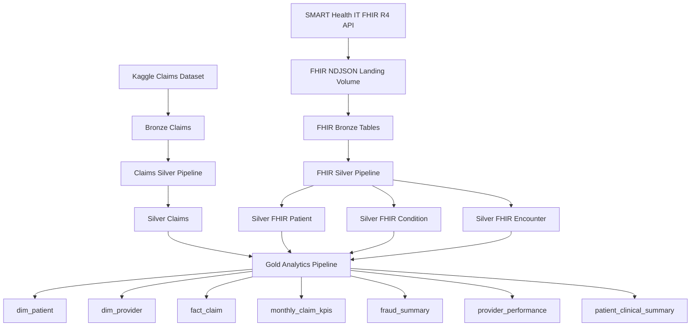
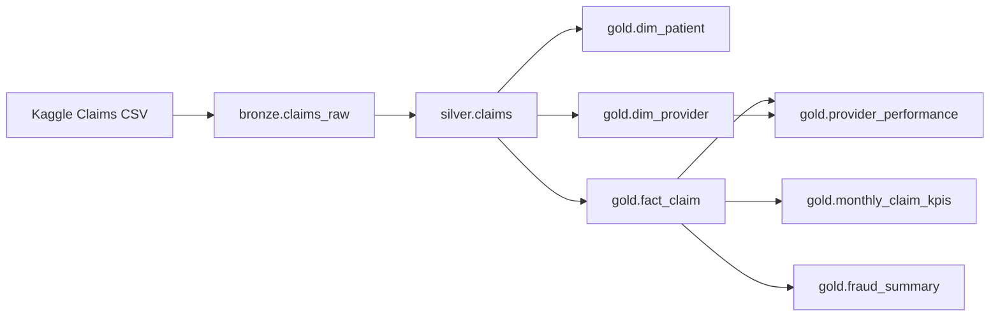
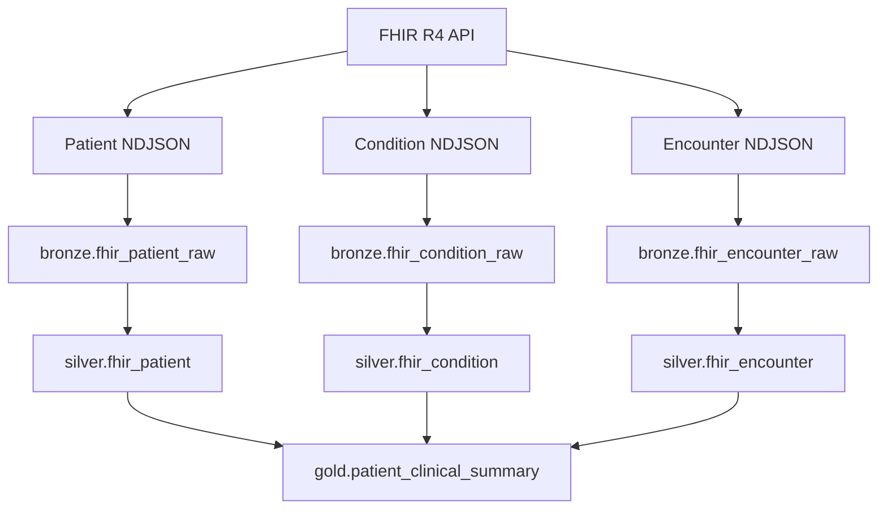
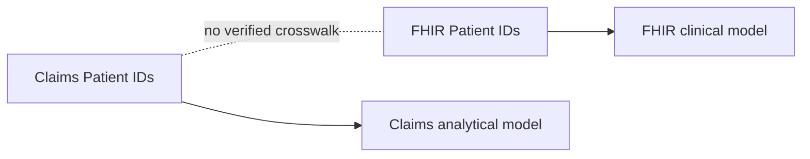
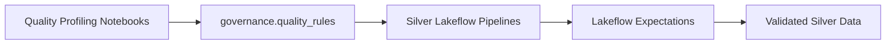
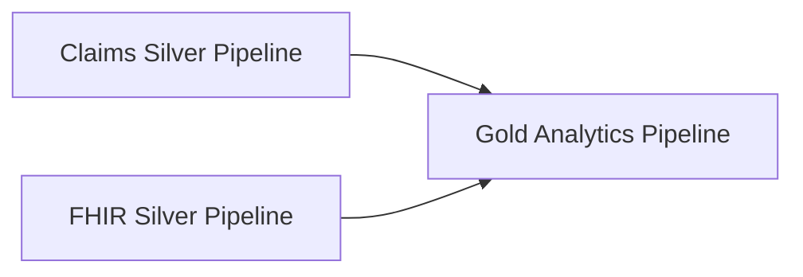

# Architecture

## Overview

I designed the Khaoula Healthy Insurance Project as an end-to-end Azure
Databricks lakehouse that demonstrates ingestion, transformation, data quality,
dimensional modeling, orchestration, governance, and operational design.

The architecture follows the Medallion pattern:

- Bronze for raw ingestion
- Silver for validated and standardized datasets
- Gold for business-facing analytical models

I use two independent healthcare data sources:

1. Kaggle health insurance claims data
2. SMART Health IT FHIR R4 API data

The two sources demonstrate different ingestion patterns and remain logically
separate where no verified identifier relationship exists.

---

## End-to-end architecture



---

## Technology stack

I use the following technologies and Databricks capabilities:

| Area | Technology |
|---|---|
| Cloud platform | Microsoft Azure |
| Processing platform | Azure Databricks |
| Compute | Databricks Serverless |
| Storage model | Delta Lake |
| Governance | Unity Catalog |
| Raw API landing | Unity Catalog Volumes |
| File ingestion | Auto Loader |
| Batch ingestion | Spark / Delta |
| Transformations | PySpark / sql |
| Declarative processing | Lakeflow Declarative Pipelines |
| Data quality | Lakeflow expectations |
| Workflow orchestration | Lakeflow Jobs |
| Deployment | Databricks Asset Bundles |
| Version control | Git / GitHub |
| Security | Unity Catalog RBAC and ABAC |
| Optimization strategy | Predictive optimization / liquid clustering evaluation |

---

# Claims data flow

The Claims domain begins with a batch dataset containing insurance Claim,
Patient, Provider, financial, utilization, and historical fraud information.



The Silver layer standardizes types, column names, categorical values, dates,
and derived operational attributes.

The Gold layer restructures the validated claims dataset into a dimensional
analytical model.

---

# FHIR data flow

I ingest three FHIR R4 resource types:

- Patient
- Condition
- Encounter

The API extractor writes raw resources to a Unity Catalog Volume as NDJSON.

Auto Loader then processes those files into Bronze Delta tables.



I keep the raw FHIR JSON in Bronze and extract only the fields required for the
project in Silver.

The Silver transformations also preserve:

- FHIR resource version ID
- FHIR last-updated timestamp
- ingestion metadata
- source-system metadata

I resolve repeated FHIR resource versions by keeping the latest resource
version available in Bronze.

## Lakehouse data layers

| Layer | Dataset | Purpose |
|---|---|---|
| Bronze | `claims_raw` | Raw Claims ingestion |
| Bronze | `fhir_patient_raw` | Raw FHIR Patient JSON |
| Bronze | `fhir_condition_raw` | Raw FHIR Condition JSON |
| Bronze | `fhir_encounter_raw` | Raw FHIR Encounter JSON |
| Silver | `claims` | Validated standardized Claims |
| Silver | `fhir_patient` | Validated Patient resources |
| Silver | `fhir_condition` | Validated Condition resources |
| Silver | `fhir_encounter` | Validated Encounter resources |
| Gold | `dim_patient` | Claims Patient dimension |
| Gold | `dim_provider` | Provider dimension |
| Gold | `fact_claim` | Claim fact |
| Gold | `monthly_claim_kpis` | Monthly analytics |
| Gold | `fraud_summary` | Fraud analytics |
| Gold | `provider_performance` | Provider analytics |
| Gold | `patient_clinical_summary` | FHIR clinical analytics |
---

# Domain separation

The Claims dataset and FHIR API are independent synthetic data sources.

Both contain fields named `patient_id`, but I do not have a verified crosswalk
proving that those identifiers represent the same individuals.

I therefore avoid joining them artificially.



This preserves data integrity and avoids creating relationships that are not
supported by the source systems.

---

# Data quality architecture

I separate rule authoring from rule enforcement.

During profiling, I identify appropriate business and technical constraints.

The approved rules are stored centrally in:

`health_insurance.governance.quality_rules`



Each rule stores metadata including:

- dataset
- rule name
- constraint
- severity
- active status
- description
- owner
- version
- source notebook
- timestamps

The Silver pipelines dynamically load the active rules and apply them using
Lakeflow expectations.

I use three severity levels:

- `WARN`
- `DROP`
- `FAIL`

This allows data-quality behavior to be centrally governed rather than
hard-coded independently across multiple transformation notebooks.

---

# Pipeline architecture

I separate the project into three declarative pipelines.

## Claims Silver Pipeline

Processes:

`health_insurance.bronze.claims_raw`

into:

`health_insurance.silver.claims`

## FHIR Silver Pipeline

Processes:

- FHIR Patient
- FHIR Condition
- FHIR Encounter

into their validated Silver datasets.

## Gold Analytics Pipeline

Consumes the canonical Silver datasets and creates the dimensional and
analytical Gold models.



This separation allows the two ingestion domains to evolve independently while
sharing the same downstream analytical layer.

---

# Deployment architecture

I define pipelines and Jobs through a Databricks Asset Bundle.

The bundle contains:

```text
06-pipelines/
├── databricks.yml
└── resources/
    ├── silver_pipelines.pipeline.yml
    ├── gold_pipeline.pipeline.yml
    └── health_insurance_job.job.yml
```

The bundle provides declarative infrastructure definitions for:

- Claims Silver pipeline
- FHIR Silver pipeline
- Gold Analytics pipeline
- end-to-end Lakeflow Job

This keeps deployable Databricks resources under version control alongside the
transformation source code.

---

# Repository architecture

```text
Khaoula-healthy-insurance-project/
│
├── 01-setup/
│
├── 02-ingestion/
│
├── 03-silver-transformations/
│
├── 04-data-quality/
│
├── 05-gold-transformations/
│
├── 06-pipelines/
│   ├── databricks.yml
│   └── resources/
│
├── 07-governance/
│
├── 08-optimization/
│
├── 09-docs/
│   ├── architecture.md
│   ├── data_model.md
│   └── operations.md
│
└── README.md
```

Each folder represents a distinct stage of the engineering lifecycle rather
than an isolated exercise.

---

# Architecture principles

The project follows several design principles.

### Separation of concerns

Ingestion, transformation, quality enforcement, analytics, orchestration,
governance, and deployment are maintained as separate responsibilities.

### Declarative processing

I use Lakeflow Declarative Pipelines for dataset dependency management and
Lakeflow Jobs for workflow-level orchestration.

### Governed data quality

Quality rules are stored as governed metadata and consumed dynamically by
Silver pipelines.

### Reproducible deployment

Pipelines and Jobs are defined through Databricks Asset Bundles and versioned
in Git.

### Evidence-based optimization

I avoid unnecessary partitioning, Z-Ordering, and manual optimization on the
current small dataset.

### Data integrity

I do not create relationships between independent data sources unless the
source systems provide evidence that the relationship exists.