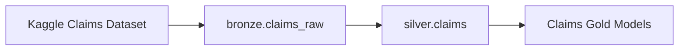
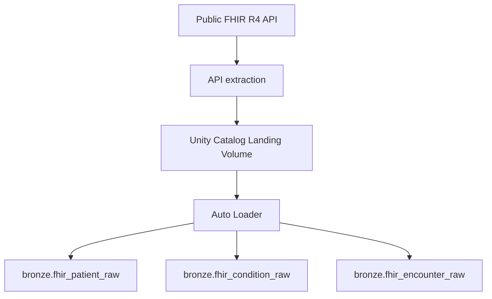
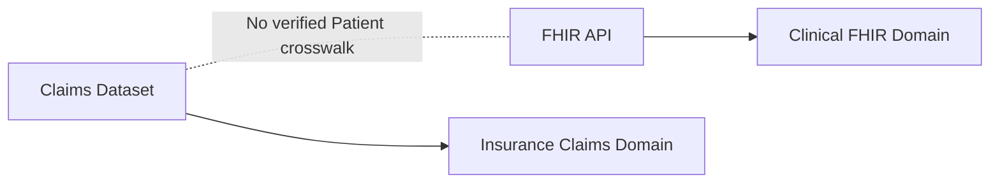

# Data Sources

## Overview

I use two independent healthcare data sources in this project:

1. a health insurance Claims dataset
2. public FHIR R4 healthcare resources

The sources serve different purposes.

The Claims dataset provides structured insurance, financial, Provider, and fraud
information.

The FHIR source provides healthcare interoperability data representing Patients,
Conditions, and Encounters.

I intentionally use both sources to demonstrate multiple ingestion patterns
within the same Databricks lakehouse.

---

# Source 1: Health Insurance Claims Dataset

## Source type

Batch file dataset.

The Claims data originates from a Kaggle healthcare insurance dataset and is
ingested into the lakehouse as structured tabular data.

The source contains:

**20,100 Claim records**

with:

**30 source columns**

---

## Source characteristics

The dataset combines several types of information within each Claim record:

- Claim identifiers
- Patient attributes
- insurance Policy information
- Provider information
- healthcare service information
- financial measures
- utilization measures
- operational Claim history
- historical fraud labels

The original source columns are:

```text
Patient_ID
Policy_Number
Claim_ID
Claim_Date
Service_Date
Policy_Expiration_Date
Claim_Amount
Patient_Age
Patient_Gender
Patient_City
Patient_State
Hospital_ID
Provider_Type
Provider_Specialty
Provider_City
Provider_State
Diagnosis_Code
Procedure_Code
Number_of_Procedures
Admission_Type
Discharge_Type
Length_of_Stay_Days
Service_Type
Deductible_Amount
CoPay_Amount
Number_of_Previous_Claims_Patient
Number_of_Previous_Claims_Provider
Provider_Patient_Distance_Miles
Claim_Submitted_Late
Is_Fraudulent
```

---

# Claims data categories

## Claim identifiers and dates

The dataset contains:

- `Claim_ID`
- `Policy_Number`
- `Claim_Date`
- `Service_Date`
- `Policy_Expiration_Date`

These fields allow me to model individual Claims and analyze Claim activity over
time.

---

## Patient information

The Claims dataset contains limited Patient demographic information:

- `Patient_ID`
- `Patient_Age`
- `Patient_Gender`
- `Patient_City`
- `Patient_State`

I use these attributes to construct the Claims-based Gold Patient dimension.

The Claims dataset does not contain direct Patient contact information such as
name or phone number.

---

## Provider information

Provider-related fields include:

- `Hospital_ID`
- `Provider_Type`
- `Provider_Specialty`
- `Provider_City`
- `Provider_State`

The source does not provide a dedicated Provider identifier.

For the analytical model, I therefore treat the combination of these fields as a
Provider profile and generate a deterministic Provider key.

---

## Clinical and service information

The source contains:

- `Diagnosis_Code`
- `Procedure_Code`
- `Service_Type`
- `Admission_Type`
- `Discharge_Type`
- `Number_of_Procedures`
- `Length_of_Stay_Days`

These fields provide Claim-level healthcare utilization context.

The Claims source is not treated as a full clinical record system.

---

## Financial information

Financial fields include:

- `Claim_Amount`
- `Deductible_Amount`
- `CoPay_Amount`

From these source values I derive analytical measures such as:

```text
Patient out-of-pocket amount
=
Deductible + Copay
```

and an estimated remaining insurer amount.

The insurer amount is explicitly treated as an analytical estimate because the
source does not provide a true insurer-paid field.

---

## Operational and historical information

The source also includes:

- `Number_of_Previous_Claims_Patient`
- `Number_of_Previous_Claims_Provider`
- `Provider_Patient_Distance_Miles`
- `Claim_Submitted_Late`

These fields support operational and Provider-performance analysis.

---

## Fraud label

The dataset includes:

`Is_Fraudulent`

I treat this as a historical source label.

The project does not train or claim to provide a fraud-prediction model.

Instead, I use the label to produce descriptive Gold analytics such as:

- fraud rate
- fraudulent Claim amount
- fraud amount share
- Provider fraud incidence
- fraud patterns by Claim category

---

# Claims ingestion path

The Claims source follows a batch ingestion pattern.



The Bronze layer preserves the ingested source structure.

The Silver layer performs:

- snake_case standardization
- explicit typing
- date conversion
- text normalization
- quality enforcement
- analytical derivations required by downstream models

---

# Source 2: FHIR R4 API

## Source type

Public REST API.

I use the SMART Health IT public FHIR R4 endpoint as a second healthcare source.

FHIR stands for:

**Fast Healthcare Interoperability Resources**

FHIR represents healthcare information as standardized resources that can be
exchanged between systems through APIs.

---

# FHIR resources used

I intentionally limit the project to three resource types:

- Patient
- Condition
- Encounter

This provides enough clinical relationships to demonstrate API ingestion,
nested JSON processing, resource references, version handling, and clinical
analytics without unnecessarily increasing project scope.

---

# Patient resource

The FHIR Patient resource provides Patient demographic and identification
information.

The Silver Patient model extracts fields including:

- FHIR Patient ID
- medical record number
- given name
- family name
- gender
- birth date
- age
- age group
- phone
- address
- city
- state
- postal code
- country

The source also provides FHIR metadata such as:

- `meta.versionId`
- `meta.lastUpdated`

These fields are retained so repeated versions of the same resource can be
resolved deterministically.

---

# Condition resource

The FHIR Condition resource represents a Patient diagnosis, health problem, or
clinical condition.

The Silver model extracts information including:

- Condition ID
- Patient reference
- Encounter reference
- Condition code
- Condition name
- clinical status
- verification status
- onset timestamp
- abatement timestamp

Examples of analytical questions supported by this resource include:

- How many Conditions are recorded for each Patient?
- How many Conditions are currently active?
- When was the first Condition recorded?
- How many distinct Condition codes are associated with a Patient?

---

# Encounter resource

The FHIR Encounter resource represents interactions between Patients and
healthcare services.

The Silver model extracts fields including:

- Encounter ID
- Patient reference
- Practitioner reference
- Organization reference
- Encounter type
- Encounter class
- Encounter status
- start timestamp
- end timestamp

Encounter classes observed in the project include:

```text
AMB
EMER
IMP
```

representing:

- ambulatory
- emergency
- inpatient

This allows the Gold clinical model to calculate metrics such as:

- total Encounters
- ambulatory Encounters
- emergency Encounters
- inpatient Encounters
- average Encounter duration
- Patient Encounter history

---

# FHIR API ingestion

The FHIR source uses a different ingestion pattern from the Claims dataset.



The API extractor retrieves FHIR Bundles page by page.

Individual resources are written to the landing area as raw NDJSON.

Auto Loader then discovers new landing files and loads the raw JSON into Bronze
Delta tables.

---

# FHIR landing storage

Raw API responses are stored in a Unity Catalog Volume.

The project uses separate landing locations for:

```text
Patient
Condition
Encounter
```

and separate Auto Loader checkpoint/state locations.

This keeps ingestion state isolated by FHIR resource type.

---

# Raw Bronze representation

FHIR Bronze tables intentionally preserve the resource as raw JSON.

Each Bronze record contains:

- raw FHIR JSON
- ingestion timestamp
- source system
- resource type

This provides a recoverable raw layer and avoids losing source information
during ingestion.

---

# FHIR version handling

FHIR resources can be returned multiple times with different versions.

I preserve:

```text
meta.versionId
meta.lastUpdated
```

during Silver transformation.

The Silver pipeline resolves repeated versions of the same FHIR resource by
preferring the latest available resource based primarily on:

1. FHIR last-updated timestamp
2. ingestion timestamp
3. FHIR version ID

A hash of the raw resource is also available as a fallback deduplication key
when necessary.

This prevents repeated API extraction from producing multiple current-state
records for the same FHIR resource.

---

# Source-system relationship

The Claims dataset and FHIR dataset are independent sources.



Both sources contain a field that can be represented as `patient_id`.

However, identical column names do not prove that the identifiers refer to the
same individual.

I do not join the Claims Patients to FHIR Patients because no verified
crosswalk exists between the two source systems.

This prevents unsupported relationships from entering the analytical model.

---

# Why I use two sources

The two sources allow the project to demonstrate different data-engineering
patterns.

| Capability | Claims | FHIR |
|---|---:|---:|
| Batch ingestion | Yes | |
| REST API ingestion | | Yes |
| Structured tabular source | Yes | |
| Nested JSON | | Yes |
| Unity Catalog Volume landing | | Yes |
| Auto Loader | | Yes |
| Incremental file discovery | | Yes |
| Schema standardization | Yes | Yes |
| Data quality validation | Yes | Yes |
| Version-aware processing | | Yes |
| Dimensional modeling | Yes | |
| Clinical aggregation | | Yes |

Together, the sources demonstrate how one Databricks lakehouse can support
multiple ingestion and analytical patterns while preserving clear source-system
boundaries.

---

# Source-to-layer mapping

| Source | Bronze | Silver | Gold |
|---|---|---|---|
| Claims dataset | `claims_raw` | `claims` | Claims dimensional and analytical models |
| FHIR Patient | `fhir_patient_raw` | `fhir_patient` | `patient_clinical_summary` |
| FHIR Condition | `fhir_condition_raw` | `fhir_condition` | `patient_clinical_summary` |
| FHIR Encounter | `fhir_encounter_raw` | `fhir_encounter` | `patient_clinical_summary` |

---

# Data-source principles

## Preserve raw data

I keep raw source representations in Bronze so transformations remain
reproducible.

## Treat source systems independently

I do not infer relationships merely because source fields have similar names.

## Retain source metadata

I preserve ingestion and source-system metadata throughout the lakehouse.

## Handle API resource versions

FHIR resources are version-aware and Silver processing resolves current
resource state deterministically.

## Limit scope intentionally

I use only the FHIR resources needed to demonstrate meaningful healthcare data
engineering patterns rather than ingesting every available FHIR resource.