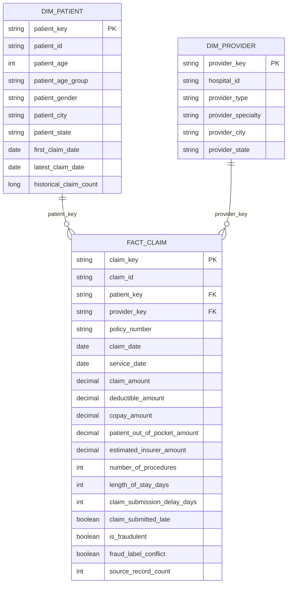
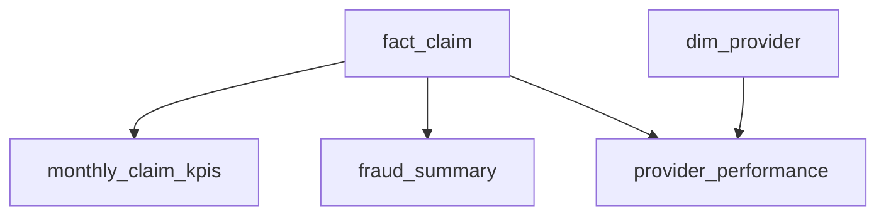
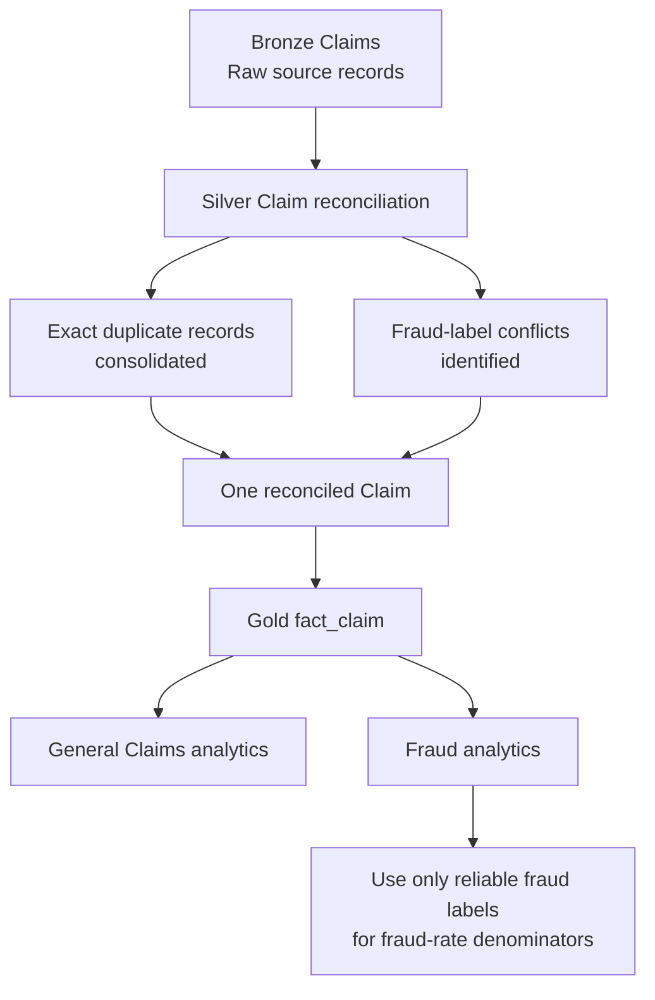
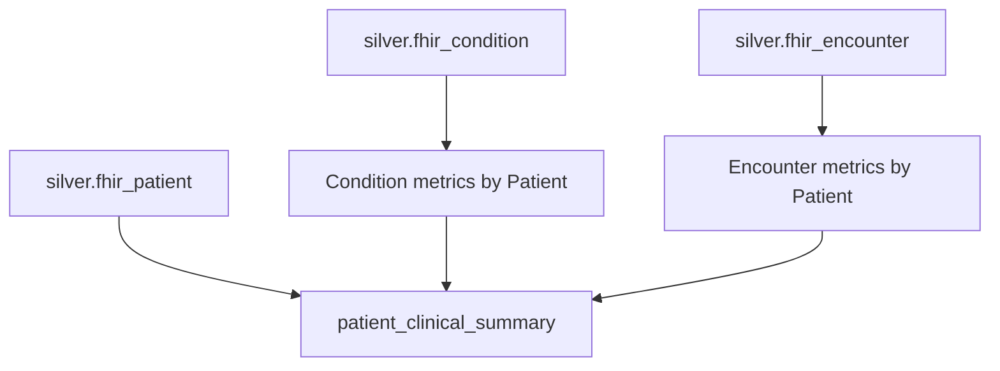
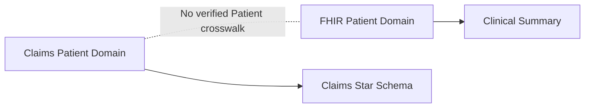

# Data Model

## Overview

I designed the Gold layer as two separate analytical domains:

1. Claims analytics
2. FHIR clinical analytics

The Claims domain follows a dimensional model with reusable dimensions, a
central fact table, and downstream analytical aggregates.

The FHIR domain remains separate because the FHIR Patient identifiers do not
have a verified crosswalk to the Claims Patient identifiers.

---

# Claims dimensional model



The central fact grain is:

**one row per insurance claim**

This grain is established in Silver before the Gold model is built.

The raw Claims source contains repeated Claim records. Silver reconciles those
records using the Claim's business attributes before Gold processing.

When repeated source records agree on the fraud label, a single Claim is
retained with that historical label.

When repeated source records disagree only on the historical fraud label, the
Claim is retained but:

- `is_fraudulent` is set to `NULL`
- `fraud_label_conflict` is set to `true`
- `source_record_count` records how many Bronze records were reconciled

This avoids arbitrarily selecting a conflicting source value while preserving
the Claim itself for non-fraud analytics.

---

# `dim_patient`

## Purpose

`dim_patient` provides reusable Patient attributes for Claims analytics.

## Grain

One row per Claims `patient_id`.

## Key

`patient_key`

I generate the key deterministically using the Claims Patient identifier.

Conceptually:

```text
CLAIMS_PATIENT || patient_id
        ↓
      SHA-256
        ↓
    patient_key
```

## Main attributes

- Patient ID
- age
- age group
- gender
- city
- state
- first observed Claim date
- latest observed Claim date
- historical Claim count

I derive the current demographic profile from the latest available Claim record
for each Patient.

Because Claim duplicates are reconciled in Silver before Gold processing,
`historical_claim_count` represents reconciled Claims rather than duplicated
source rows.

---

# `dim_provider`

## Purpose

`dim_provider` provides reusable Provider attributes for Claims analytics.

## Grain

One row per distinct Provider profile.

The source does not contain a dedicated Provider ID, so I define the profile
using:

- hospital ID
- Provider type
- Provider specialty
- Provider city
- Provider state

## Key

`provider_key`

The key is generated deterministically from the complete Provider profile.

Conceptually:

```text
hospital_id
provider_type
provider_specialty
provider_city
provider_state
        ↓
      SHA-256
        ↓
   provider_key
```

I replace missing Provider attributes with a stable `UNKNOWN` value during key
generation so the same profile always produces the same key.

---

# `fact_claim`

## Purpose

`fact_claim` is the central analytical fact table for the Claims domain.

## Grain

One row per reconciled insurance Claim.

## Keys

- `claim_key`
- `patient_key`
- `provider_key`

`claim_key` is generated deterministically from the source `claim_id`.

Conceptually:

```text
CLAIM || claim_id
        ↓
      SHA-256
        ↓
     claim_key
```

`patient_key` uses the same formula as `dim_patient`.

`provider_key` uses the same formula as `dim_provider`.

This provides stable fact-to-dimension relationships across pipeline refreshes.

## Financial measures

- Claim amount
- deductible amount
- copay amount
- Patient out-of-pocket amount
- estimated insurer amount

`estimated_insurer_amount` is a derived analytical estimate:

```text
claim amount
- deductible amount
- copay amount
```

with a lower bound of zero.

It should not be interpreted as an actual insurer payment supplied by the
source system.

## Utilization measures

- number of procedures
- length of stay
- Provider-Patient distance

## Operational measures

- Claim submission delay
- previous Patient Claim count
- previous Provider Claim count

## Analytical and quality flags

- Claim submitted late
- historical fraud label
- fraud-label conflict indicator
- reconciled source-record count

`is_fraudulent` is treated as a historical source label rather than a prediction
produced by this project.

When the source provides conflicting fraud labels for the same Claim,
`is_fraudulent` is set to `NULL`.

`fraud_label_conflict = true` explicitly identifies these Claims.

`source_record_count` records how many Bronze source rows were consolidated into
the final Silver Claim before it entered Gold.

This allows downstream analytics to distinguish:

```text
all Claims
```

from:

```text
Claims with reliable historical fraud labels
```

without discarding otherwise valid Claim records.

---

# Claims analytical products

The Claim fact model feeds three downstream analytical materialized views.



Fraud-related metrics follow one important rule:

> Claims with conflicting fraud labels remain in general Claims analytics but
> are excluded from fraud-rate denominators.

This prevents an unresolved source-quality issue from being interpreted as a
confirmed fraud or non-fraud outcome.

---

## `monthly_claim_kpis`

### Grain

One row per Claim year-month.

### Purpose

Monitor Claims activity, financial performance, submission behavior, and
historical fraud trends over time.

### Metrics

- total Claims
- total Claim amount
- average Claim amount
- total Patient out-of-pocket amount
- total estimated insurer amount
- fraud-labeled Claims
- fraud-label conflicts
- fraudulent Claims
- fraud rate
- late Claims
- late-submission rate
- average submission delay

### Fraud-rate definition

The fraud rate is calculated as:

```text
fraudulent Claims
-------------------------- × 100
fraud-labeled Claims
```

`fraud-labeled Claims` includes only Claims where `is_fraudulent` is not null.

Claims with `fraud_label_conflict = true` therefore remain part of overall Claim
volume but are not included in the fraud-rate denominator.

---

## `fraud_summary`

### Grain

One row per:

- Claim amount band
- service type

### Purpose

Analyze historical fraud patterns while accounting for unreliable source fraud
labels.

### Metrics

- total Claims
- total Claim amount
- fraud-labeled Claims
- fraud-label conflicts
- fraudulent Claims
- fraud rate
- fraud-labeled Claim amount
- fraudulent Claim amount
- fraud Claim amount share
- average fraudulent Claim amount

### Fraud-rate definition

```text
fraudulent Claims
-------------------------- × 100
fraud-labeled Claims
```

### Fraud Claim amount share

The financial fraud share is calculated using only Claim amounts that have a
reliable fraud classification:

```text
fraudulent Claim amount
-------------------------------- × 100
fraud-labeled Claim amount
```

This avoids including Claims with unresolved fraud labels in the financial
denominator.

This dataset summarizes historical source labels and does not perform fraud
prediction.

---

## `provider_performance`

### Grain

One row per Provider profile.

### Purpose

Compare Provider activity, financial performance, operational behavior, and
historical fraud patterns.

### Metrics

- total Claims
- distinct Patients
- total Claim amount
- average Claim amount
- total estimated insurer amount
- fraud-labeled Claims
- fraud-label conflicts
- fraudulent Claims
- fraud rate
- late Claims
- late-submission rate
- average submission delay
- average procedure count
- average length of stay

The model joins `fact_claim` to `dim_provider` through `provider_key`.

Provider fraud rate follows the same reliability rule as the other Gold fraud
products:

```text
fraudulent Claims
-------------------------- × 100
fraud-labeled Claims
```

This ensures a Provider is not penalized or favored because of unresolved
source fraud labels.

---

# Claims data-quality flow

Claims duplicate reconciliation occurs before Gold analytics.



Bronze remains the immutable representation of what arrived from the source.

Silver resolves business-record duplication and identifies uncertainty.

Gold exposes the resulting quality metadata so analytical products can use the
data appropriately.

---

# FHIR clinical model

The FHIR analytical model is intentionally separate from the Claims star schema.



---

# `patient_clinical_summary`

## Purpose

`patient_clinical_summary` provides a Patient-level clinical analytical view.

## Grain

One row per FHIR Patient.

I aggregate Conditions and Encounters independently to the Patient grain before
joining them to Patient.

This prevents row multiplication caused by joining multiple one-to-many
relationships directly.

For example:

```text
1 Patient
3 Conditions
4 Encounters
```

A direct detailed join could produce:

```text
3 × 4 = 12 rows
```

Instead, I first create:

```text
1 Patient Condition summary
1 Patient Encounter summary
```

and then join both summaries to:

```text
1 Patient row
```

so the final grain remains:

```text
1 row per Patient
```

---

## Patient attributes

The model contains selected validated FHIR Patient attributes including:

- medical record number
- given name
- family name
- gender
- birth date
- age
- age group
- phone
- city
- state
- postal code
- country

Sensitive attributes are governed separately through Unity Catalog security
controls.

---

## Condition metrics

- total Conditions
- distinct condition codes
- active Conditions
- resolved Conditions
- confirmed Conditions
- first Condition onset
- latest Condition onset
- active-condition indicator

---

## Encounter metrics

- total Encounters
- ambulatory Encounters
- emergency Encounters
- inpatient Encounters
- distinct organizations
- distinct practitioners
- first Encounter
- latest Encounter
- average Encounter duration
- total Encounter duration
- Encounter-history indicator

---

# Domain separation

The two analytical domains remain separate.



I do not join the two domains only because both contain a field called
`patient_id`.

A relationship between source systems should be supported by a verified
crosswalk or shared business identifier.

This design avoids introducing false relationships into the Gold model.

---

# Gold datasets

| Dataset | Grain | Type |
|---|---|---|
| `dim_patient` | one Claims Patient | Dimension |
| `dim_provider` | one Provider profile | Dimension |
| `fact_claim` | one reconciled Claim | Fact |
| `monthly_claim_kpis` | one Claim year-month | Aggregate |
| `fraud_summary` | Claim amount band + service type | Aggregate |
| `provider_performance` | one Provider profile | Aggregate |
| `patient_clinical_summary` | one FHIR Patient | Clinical aggregate |

---

# Modeling principles

## Explicit grain

I define the grain of every Gold dataset before creating its transformations.

For the Claims fact table, the one-row-per-Claim grain is established through
Silver Claim reconciliation before Gold processing.

## Preserve raw source truth

I preserve raw source records in Bronze rather than silently removing source
quality issues during ingestion.

## Resolve quality issues explicitly

I resolve duplicate business records in Silver and retain metadata describing
how that reconciliation occurred.

When a source attribute is genuinely ambiguous, I represent that uncertainty
instead of inventing a value.

## Deterministic keys

I use deterministic surrogate keys so dimensional relationships are
reproducible across pipeline refreshes.

## Reliable analytical denominators

Fraud-rate metrics use only Claims with a reliable historical fraud label as
their denominator.

Claims with ambiguous fraud labels remain available for other valid analytical
purposes.

## Reduced duplication

Patient and Provider descriptive attributes remain in reusable dimensions rather
than being repeated unnecessarily throughout the Claim fact.

## Domain integrity

I do not combine independent source systems without evidence of a valid
relationship.

The Claims and FHIR Patient domains therefore remain separate.

## Analytical usability

I create pre-aggregated Gold datasets for common reporting use cases such as:

- monthly Claim monitoring
- fraud analysis
- Provider performance
- Patient clinical history

This provides analysis-ready datasets while preserving clear lineage back to
the validated Silver layer.