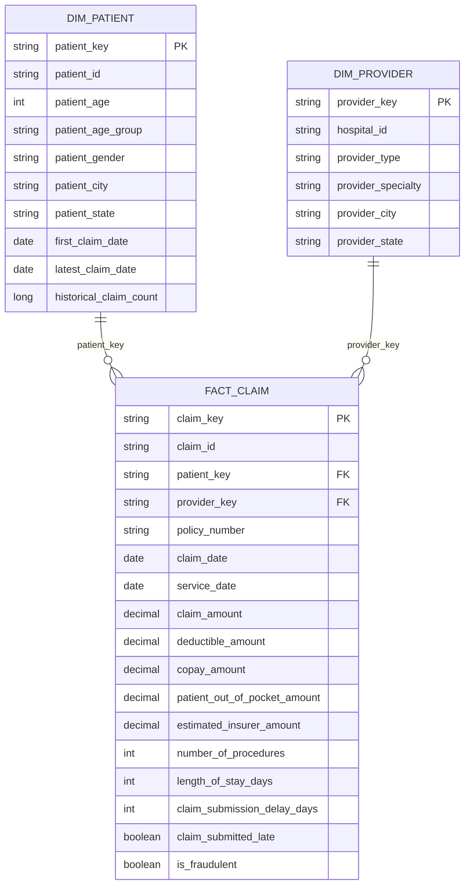
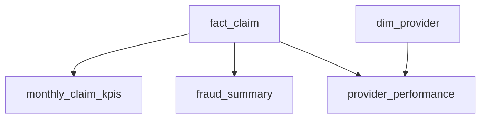
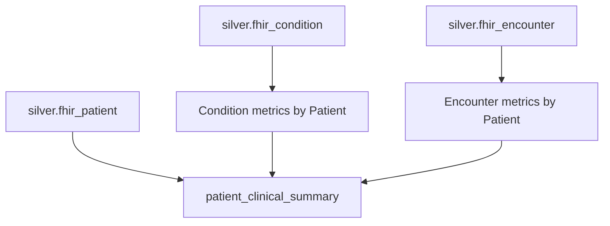
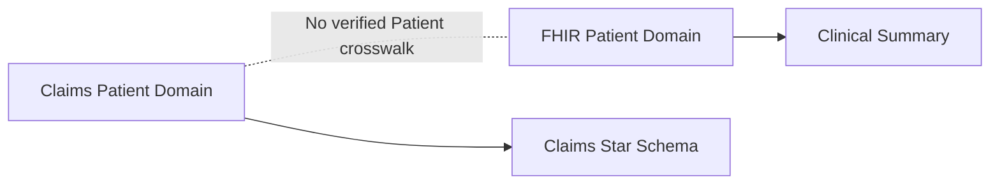

# Data Model

## Overview

I designed the Gold layer as two separate analytical domains:

1. Claims analytics
2. FHIR clinical analytics

The Claims domain follows a dimensional model with dimensions, a central fact
table, and downstream analytical aggregates.

The FHIR domain remains separate because the FHIR Patient identifiers do not
have a verified crosswalk to the Claims Patient identifiers.

---

# Claims dimensional model



The central fact grain is:

**one row per insurance claim**

---

# `dim_patient`

## Purpose

`dim_patient` provides reusable patient attributes for Claims analytics.

## Grain

One row per Claims `patient_id`.

## Key

`patient_key`

I generate the key deterministically using the Claims Patient identifier.

Conceptually:

```text
CLAIMS_PATIENT || patient_id
        ↓
      SHA-256
        ↓
    patient_key
```

## Main attributes

- patient ID
- age
- age group
- gender
- city
- state
- first observed claim date
- latest observed claim date
- historical claim count

I derive the current demographic profile from the latest available Claim record
for each Patient.

---

# `dim_provider`

## Purpose

`dim_provider` provides reusable Provider attributes for Claims analytics.

## Grain

One row per distinct Provider profile.

The source does not contain a dedicated Provider ID, so I define the profile
using:

- hospital ID
- Provider type
- Provider specialty
- Provider city
- Provider state

## Key

`provider_key`

The key is generated deterministically from the complete Provider profile.

Conceptually:

```text
hospital_id
provider_type
provider_specialty
provider_city
provider_state
        ↓
      SHA-256
        ↓
   provider_key
```

I replace missing Provider attributes with a stable `UNKNOWN` value during key
generation so the same profile always produces the same key.

---

# `fact_claim`

## Purpose

`fact_claim` is the central analytical fact table.

## Grain

One row per insurance claim.

## Keys

- `claim_key`
- `patient_key`
- `provider_key`

`patient_key` uses the same formula as `dim_patient`.

`provider_key` uses the same formula as `dim_provider`.

This provides stable fact-to-dimension relationships across pipeline refreshes.

## Financial measures

- claim amount
- deductible amount
- copay amount
- patient out-of-pocket amount
- estimated insurer amount

## Utilization measures

- number of procedures
- length of stay
- Provider-Patient distance

## Operational measures

- Claim submission delay
- previous Patient Claim count
- previous Provider Claim count

## Flags

- Claim submitted late
- historical fraud label

`is_fraudulent` is treated as a historical source label rather than a prediction
produced by this project.

---

# Claims analytical products

The fact model feeds three downstream analytical materialized views.



---

## `monthly_claim_kpis`

### Grain

One row per Claim year-month.

### Purpose

Monitor Claims activity over time.

### Metrics

- total Claims
- total Claim amount
- average Claim amount
- total Patient out-of-pocket amount
- estimated insurer amount
- fraudulent Claims
- fraud rate
- late Claims
- late-submission rate
- average submission delay

---

## `fraud_summary`

### Grain

One row per:

- Claim amount band
- service type

### Purpose

Analyze historical fraud patterns.

### Metrics

- total Claims
- total Claim amount
- fraudulent Claims
- fraud rate
- fraudulent Claim amount
- fraud Claim amount share
- average fraudulent Claim amount

This dataset summarizes fraud behavior but does not perform fraud prediction.

---

## `provider_performance`

### Grain

One row per Provider profile.

### Purpose

Compare Provider activity and performance.

### Metrics

- total Claims
- distinct Patients
- total Claim amount
- average Claim amount
- estimated insurer amount
- fraudulent Claims
- fraud rate
- late Claims
- late-submission rate
- average submission delay
- average procedure count
- average length of stay

The model joins `fact_claim` to `dim_provider` through `provider_key`.

---

# FHIR clinical model

The FHIR analytical model is intentionally separate from the Claims star schema.



---

# `patient_clinical_summary`

## Purpose

`patient_clinical_summary` provides a Patient-level clinical analytical view.

## Grain

One row per FHIR Patient.

I aggregate Conditions and Encounters before joining them to Patient.

This prevents row multiplication caused by joining multiple one-to-many
relationships directly.

For example:

```text
1 Patient
3 Conditions
4 Encounters
```

A direct detailed join could produce:

```text
3 × 4 = 12 rows
```

Instead, I first create:

```text
1 Patient Condition summary
1 Patient Encounter summary
```

and then join both summaries to:

```text
1 Patient row
```

so the final grain remains:

```text
1 row per Patient
```

---

## Patient attributes

The model contains selected validated FHIR Patient attributes including:

- medical record number
- given name
- family name
- gender
- birth date
- age
- age group
- phone
- city
- state
- postal code
- country

Sensitive attributes are governed separately through Unity Catalog security
controls.

---

## Condition metrics

- total Conditions
- distinct condition codes
- active Conditions
- resolved Conditions
- confirmed Conditions
- first condition onset
- latest condition onset
- active-condition indicator

---

## Encounter metrics

- total Encounters
- ambulatory Encounters
- emergency Encounters
- inpatient Encounters
- distinct organizations
- distinct practitioners
- first Encounter
- latest Encounter
- average Encounter duration
- total Encounter duration
- Encounter-history indicator

---

# Domain separation

The two analytical domains remain separate.



I do not join the two domains only because both contain a field called
`patient_id`.

A relationship between source systems should be supported by a verified
crosswalk or shared business identifier.

This design avoids introducing false relationships into the Gold model.

---

# Gold datasets

| Dataset | Grain | Type |
|---|---|---|
| `dim_patient` | one Claims Patient | Dimension |
| `dim_provider` | one Provider profile | Dimension |
| `fact_claim` | one Claim | Fact |
| `monthly_claim_kpis` | one month | Aggregate |
| `fraud_summary` | Claim band + service type | Aggregate |
| `provider_performance` | one Provider profile | Aggregate |
| `patient_clinical_summary` | one FHIR Patient | Clinical aggregate |

---

# Modeling principles

## Explicit grain

I define the grain of every Gold dataset before creating its transformations.

## Deterministic keys

I use deterministic surrogate keys so dimensional relationships are reproducible
across pipeline refreshes.

## Reduced duplication

Patient and Provider descriptive attributes remain in reusable dimensions rather
than being repeated unnecessarily throughout the Claim fact.

## Domain integrity

I do not combine independent source systems without evidence of a valid
relationship.

## Analytical usability

I create pre-aggregated Gold datasets for common reporting use cases such as:

- monthly Claim monitoring
- fraud analysis
- Provider performance
- Patient clinical history