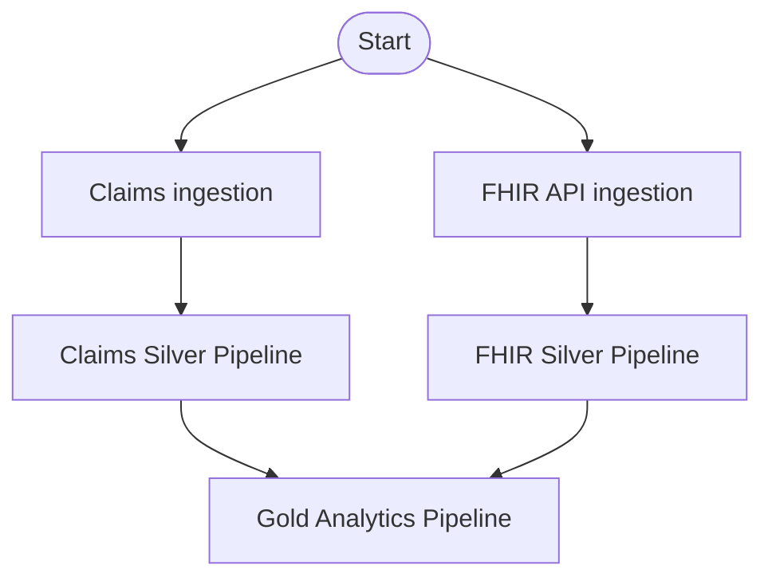

# Operations

## Overview

I designed the project so the operational workflow is controlled through
Lakeflow Jobs while dataset dependencies inside each transformation layer are
managed declaratively by Lakeflow Pipelines.

The project uses:

- Databricks Asset Bundles for deployment
- Lakeflow Jobs for workflow orchestration
- Lakeflow Declarative Pipelines for dataset processing
- Unity Catalog for governance
- Serverless compute for execution

The workflow is intentionally unscheduled in the portfolio environment so I can
control when compute is used.

---

# End-to-end workflow



The Claims and FHIR ingestion branches can run independently.

The Gold pipeline starts only after both Silver pipelines complete
successfully.

---

# Workflow orchestration

I use Lakeflow Jobs to define dependencies between separate units of work.

The Job contains:

1. Claims ingestion notebook
2. Claims Silver pipeline
3. FHIR ingestion notebook
4. FHIR Silver pipeline
5. Gold Analytics pipeline

The Claims branch follows:

```text
Claims ingestion
        ↓
Claims Silver pipeline
```

The FHIR branch follows:

```text
FHIR API ingestion
        ↓
FHIR Silver pipeline
```

The final dependency is:

```text
Claims Silver ──────┐
                    ▼
              Gold pipeline
                    ▲
FHIR Silver ────────┘
```

I define these dependencies explicitly in the Lakeflow Job resource.

---

# Pipeline-level dependencies

Inside each Lakeflow Declarative Pipeline, I do not manually define task
dependencies between datasets.

Lakeflow analyzes the datasets that each transformation reads and constructs the
dependency graph automatically.

For example:

```text
dim_provider ──────┐
                   ▼
             provider_performance
                   ▲
fact_claim ────────┘
```

The transformation code declares the reads, while Lakeflow determines the
execution order.

This creates a clear separation:

```text
Lakeflow Jobs
    ↓
workflow-level dependencies

Lakeflow Pipelines
    ↓
dataset-level dependencies
```

---

# Deployment

I deploy pipelines and Jobs through a Databricks Asset Bundle.

The bundle configuration is stored under:

```text
06-pipelines/
├── databricks.yml
└── resources/
    ├── silver_pipelines.pipeline.yml
    ├── gold_pipeline.pipeline.yml
    └── health_insurance_job.job.yml
```

The bundle defines:

- workspace target
- source synchronization
- Claims Silver pipeline
- FHIR Silver pipeline
- Gold Analytics pipeline
- end-to-end Lakeflow Job

Source folders outside the bundle root are synchronized through `sync.paths`.

The deployment process is:

```text
Git changes
    ↓
Bundle validation
    ↓
Bundle deployment
    ↓
Databricks resources updated
```

Deployment creates or updates the workflow resources but does not automatically
run the pipelines unless a workflow is explicitly triggered.

---

# Environment strategy

The Asset Bundle contains separate targets for:

- development
- production

The project currently uses the development target for testing.

The bundle name remains stable across deployments so Databricks can update the
existing bundle-managed resources instead of creating duplicate resources.

Environment-specific user identities are not hard-coded into the public
repository.

---

# Pipeline execution mode

The pipelines are configured with:

```text
serverless = true
continuous = false
```

This means the project uses serverless compute while keeping pipelines in
triggered rather than continuously running mode.

This is appropriate for the project because:

- the Claims source is batch-based
- the FHIR extraction is explicitly triggered
- continuous processing would add unnecessary cost
- the workflow can be controlled through Lakeflow Jobs

---

# Data quality enforcement

Silver data quality rules are stored centrally in:

```text
health_insurance.governance.quality_rules
```

The Silver pipelines dynamically load active rules and apply them through
Lakeflow expectations.

I use three rule severities:

```text
WARN
DROP
FAIL
```

Their intended behavior is:

| Severity | Behavior |
|---|---|
| `WARN` | Record remains available while the violation is recorded |
| `DROP` | Invalid record is removed from the validated output |
| `FAIL` | Pipeline processing fails when the critical constraint is violated |

This allows technical and business rules to be changed through governed
metadata instead of rewriting the pipeline code.

---

# Claims Silver validation

The Claims Silver pipeline was used as the first proof of the declarative
pipeline architecture.

The validation confirmed that the project could successfully execute:

```text
Bronze Claims
    ↓
Lakeflow materialized view
    ↓
governed quality rules
    ↓
Lakeflow expectations
    ↓
validated Silver Claims
```

The initial pipeline refresh processed approximately 20,000 Claims records.

The pipeline was configured as a triggered serverless workload rather than a
continuous pipeline.

---

# FHIR Silver cutover

The FHIR Silver transformations were initially developed and tested manually.

Before the first production-style FHIR Silver pipeline run, the development
tables should be preserved by renaming them.

Example:

```sql
ALTER TABLE health_insurance.silver.fhir_patient
RENAME TO health_insurance.silver.fhir_patient_dev_backup;

ALTER TABLE health_insurance.silver.fhir_condition
RENAME TO health_insurance.silver.fhir_condition_dev_backup;

ALTER TABLE health_insurance.silver.fhir_encounter
RENAME TO health_insurance.silver.fhir_encounter_dev_backup;
```

The FHIR Silver pipeline can then create the canonical pipeline-managed
datasets:

```text
health_insurance.silver.fhir_patient
health_insurance.silver.fhir_condition
health_insurance.silver.fhir_encounter
```

Downstream Gold transformations continue reading the canonical table names, so
the Gold code does not need to change after the cutover.

---

# FHIR ingestion behavior

The FHIR API extractor writes raw NDJSON resources to a Unity Catalog Volume.

The extraction process uses content-based filenames so repeated pages do not
depend on arbitrary file names.

Auto Loader then processes the landing files into Bronze Delta tables.

The FHIR Silver pipeline resolves repeated versions of the same FHIR resource by
keeping the latest available resource based primarily on:

- FHIR `meta.lastUpdated`
- ingestion timestamp
- FHIR version ID

This provides deterministic current-state Silver entities while preserving the
raw Bronze history.

---

# Failure handling

The workflow uses dependency-based failure behavior.

A downstream task only starts when its required upstream tasks complete
successfully.

Conceptually:

```text
Claims ingestion FAIL
        ↓
Claims Silver does not run
        ↓
Gold does not run
```

and:

```text
FHIR Silver FAIL
        ↓
Gold does not run
```

This prevents the Gold pipeline from publishing analytical outputs from an
incomplete workflow run.

Critical data-quality rules with `FAIL` severity can also stop Silver pipeline
processing.

---

# Governance

Unity Catalog governs:

- catalogs
- schemas
- tables
- materialized views
- Volumes
- data-quality metadata
- security policies

The project uses a governed PII classification strategy for identifiable FHIR
Patient attributes.

The intended access model separates:

```text
healthcare_analysts
```

from:

```text
healthcare_privileged
```

Analytical users receive curated Gold access while sensitive Patient values can
be masked through Unity Catalog ABAC policies.

Privileged clinical users can receive broader access when their role requires
identifiable clinical information.

---

# Cost controls

I deliberately keep the portfolio environment cost-conscious.

The main operational decisions are:

- Serverless compute
- triggered rather than continuous pipelines
- no recurring schedule in the portfolio environment
- no unnecessary repeated validation runs
- no manual optimization workloads without evidence of need
- no additional infrastructure created only for demonstration

The end-to-end Job is deployed without a schedule so compute is used only when I
explicitly trigger the workflow.

---

# Optimization strategy

The current data volume is small, so I avoid unnecessary physical tuning.

I evaluate:

- table size
- file count
- Delta history
- predictive optimization inheritance
- future clustering needs

I do not apply:

- traditional manual partitioning
- manual Z-Ordering
- recurring OPTIMIZE jobs

unless workload evidence shows that those actions would improve performance.

For future large-scale workloads, I would evaluate:

- predictive optimization
- liquid clustering
- query-history patterns
- file-size trends
- pipeline duration
- workflow cost
- serverless compute utilization

---

# Operational checks

After an end-to-end workflow run, I would validate the major outputs.

## Silver checks

```sql
SELECT COUNT(*)
FROM health_insurance.silver.claims;
```

```sql
SELECT COUNT(*)
FROM health_insurance.silver.fhir_patient;
```

```sql
SELECT COUNT(*)
FROM health_insurance.silver.fhir_condition;
```

```sql
SELECT COUNT(*)
FROM health_insurance.silver.fhir_encounter;
```

## Gold checks

```sql
SELECT COUNT(*)
FROM health_insurance.gold.fact_claim;
```

```sql
SELECT *
FROM health_insurance.gold.monthly_claim_kpis
ORDER BY claim_year, claim_month;
```

```sql
SELECT *
FROM health_insurance.gold.provider_performance
ORDER BY total_claim_amount DESC;
```

```sql
SELECT COUNT(*)
FROM health_insurance.gold.patient_clinical_summary;
```

---

# Operational monitoring

The main Databricks interfaces used for operational monitoring are:

- Lakeflow Job run history
- pipeline update history
- expectation metrics
- Delta table history
- Unity Catalog metadata

For pipeline failures, I would first inspect:

1. failed Job task
2. pipeline event log
3. expectation failures
4. source availability
5. schema or parsing errors
6. upstream table state

---

# Repository workflow

The project follows a Git-based development lifecycle.

Changes are grouped into meaningful commits for:

- ingestion
- transformations
- quality
- pipelines
- Gold modeling
- workflow orchestration
- governance
- optimization
- documentation

The Databricks Asset Bundle keeps deployable workflow configuration under
version control together with the transformation source code.

---

# Operational principles

## Fail upstream before publishing downstream

Gold should not run when required Silver processing fails.

## Keep canonical dataset names stable

Development tables can be backed up during cutover while downstream consumers
continue using the canonical Silver names.

## Separate code from environment configuration

User identities and account-specific access groups are not embedded directly
into reusable transformation logic.

## Trigger compute intentionally

The portfolio environment is designed for explicit execution rather than
continuous or scheduled workloads.

## Inspect before optimizing

I use workload evidence to decide whether physical optimization is necessary.

## Keep deployment reproducible

All Databricks pipelines and Jobs are defined through version-controlled Asset
Bundle resources.