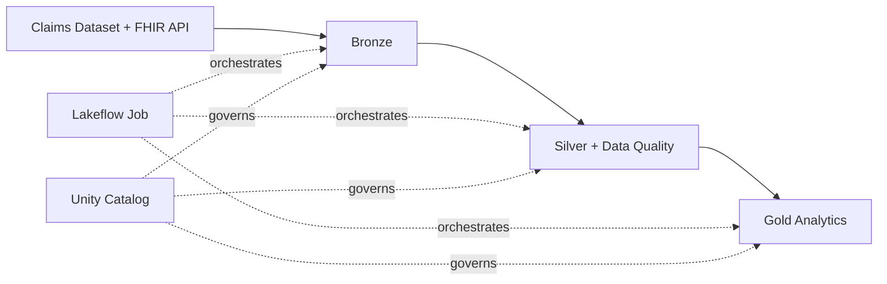
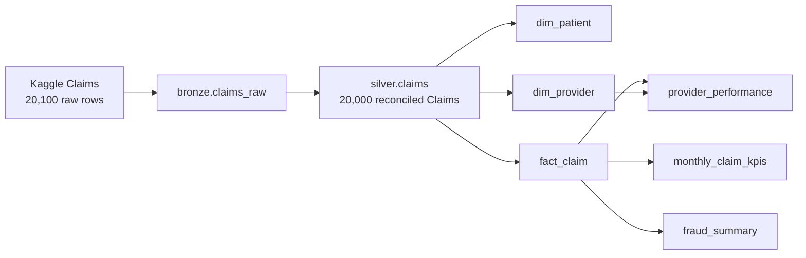
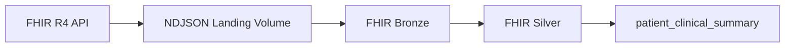
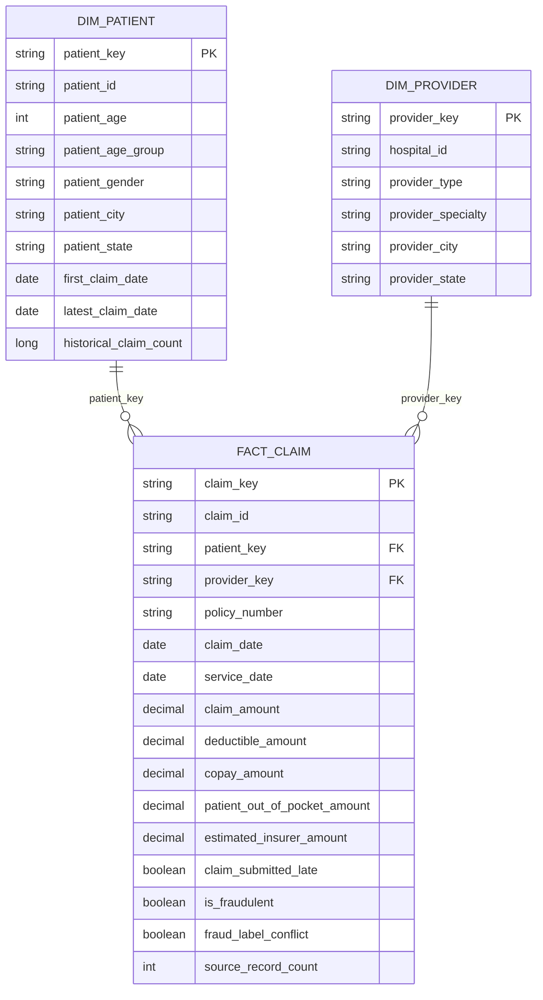
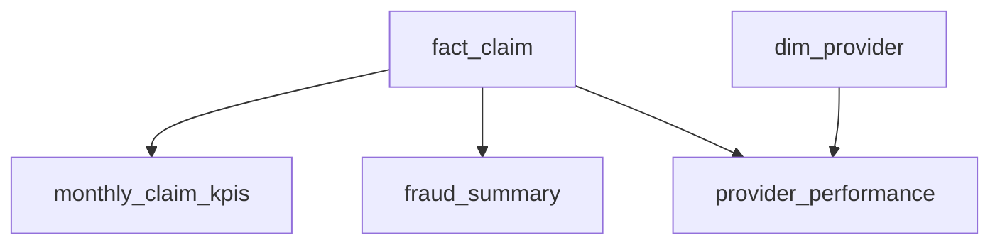
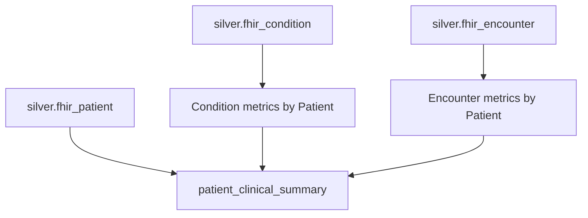
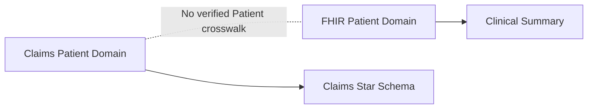

# Khaoula Healthy Insurance — Azure Databricks Lakehouse

An end-to-end healthcare data engineering project built with **Azure Databricks, Delta Lake, Unity Catalog, Lakeflow Declarative Pipelines, Lakeflow Jobs, Auto Loader, PySpark, SQL, and Databricks Asset Bundles**.

I built this project to demonstrate how multiple healthcare data sources can be ingested, governed, transformed, validated, modeled, and orchestrated through a production-style Databricks lakehouse.

The project combines:

- a batch health-insurance Claims dataset
- public SMART Health IT FHIR R4 API data
- Medallion architecture
- governed data-quality rules
- declarative Silver and Gold pipelines
- dimensional and clinical analytical models
- end-to-end workflow orchestration
- Unity Catalog security and governance
- version-controlled Databricks infrastructure
- cost-conscious Serverless execution

---

# Architecture



The project follows the Medallion architecture:

```text
Sources
   ↓
Bronze
   ↓
Silver
   ↓
Gold
```

**Bronze** preserves raw source data and technical ingestion metadata.

**Silver** standardizes, validates, reconciles duplicate business records, handles source-quality conflicts, and applies governed data-quality rules.

**Gold** provides dimensional models, Claims KPIs, fraud analytics, Provider analytics, and FHIR clinical summaries.

---

# Data Sources

I use two independent healthcare data sources to demonstrate different ingestion patterns.

## Health Insurance Claims

A structured synthetic health-insurance Claims dataset containing:

- **20,100 raw source records**
- **30 source columns**
- **20,000 distinct Claim IDs**
- Claim and Policy information
- Patient demographics
- Provider information
- healthcare service data
- financial measures
- utilization measures
- historical fraud labels

The source demonstrates:

- batch ingestion
- structured CSV processing
- Bronze-to-Silver transformation
- duplicate-record reconciliation
- data-quality handling
- dimensional modeling
- financial analytics
- historical fraud analytics

### Claims source-quality finding

Source profiling identified **100 duplicated Claim IDs**.

Further analysis showed:

- **28 duplicate cases were exact copies**
- **72 duplicate cases disagreed only on `Is_Fraudulent`**
- all other business attributes matched within those duplicated Claim records

Bronze preserves all **20,100 source rows** exactly as received.

Silver reconciles these rows into:

```text
20,000 distinct insurance Claims
```

When repeated records agree on the historical fraud label, one Claim is retained with that label.

When repeated records disagree on the fraud label:

```text
is_fraudulent = NULL
fraud_label_conflict = true
```

The Claim itself remains available for valid non-fraud analytics.

This prevents the pipeline from arbitrarily selecting an unreliable source label.

---

## SMART Health IT FHIR R4 API

The clinical domain uses the public SMART Health IT FHIR R4 API.

FHIR resources used:

- `Patient`
- `Condition`
- `Encounter`

The API source demonstrates:

- REST API extraction
- paginated FHIR Bundles
- nested healthcare JSON
- NDJSON landing
- Unity Catalog Volumes
- Auto Loader
- incremental file ingestion
- version-aware processing
- resource-reference parsing
- nested `STRUCT` and `ARRAY` processing

FHIR resources are extracted page-by-page and landed as NDJSON before Auto Loader processes the files into Bronze Delta tables.

Repeated FHIR resource versions are resolved in Silver using:

1. `meta.lastUpdated`
2. ingestion timestamp
3. `meta.versionId`
4. deterministic record hashing as a fallback

---

## Source-system separation

The Claims and FHIR Patient identifiers are deliberately **not joined**.

Although both domains contain a field representing a Patient identifier, there is no verified crosswalk proving that the identifiers represent the same people.

Creating that relationship without evidence would introduce false analytical relationships.

The two domains therefore remain logically separate.

For more detail, see:

[Data Sources](09-docs/data_sources.md)

---

# Technology Stack

| Area | Technology |
|---|---|
| Cloud | Microsoft Azure |
| Data platform | Azure Databricks |
| Processing | Apache Spark / PySpark |
| Query language | SQL |
| Storage | Delta Lake |
| Governance | Unity Catalog |
| API ingestion | Python + FHIR REST API |
| Incremental file ingestion | Auto Loader |
| Raw API landing | Unity Catalog Volumes |
| Data pipelines | Lakeflow Declarative Pipelines |
| Data quality | Lakeflow Expectations |
| Workflow orchestration | Lakeflow Jobs |
| Compute | Databricks Serverless |
| Deployment | Databricks Asset Bundles |
| Version control | Git / GitHub |

---

# Data Engineering Flow

## Claims Domain



The Claims flow is:

```text
Claims CSV
   ↓
Bronze raw snapshot
   ↓
standardization and typing
   ↓
duplicate Claim reconciliation
   ↓
fraud-label conflict handling
   ↓
governed data-quality expectations
   ↓
Silver Claims
   ↓
Gold dimensional model
   ↓
Claims analytical products
```

Bronze preserves the raw source representation.

Silver establishes the one-row-per-Claim business grain.

Gold provides reusable analytical datasets.

---

# FHIR Domain



FHIR Bronze preserves the original resource JSON together with technical lineage metadata.

Silver extracts structured entities for:

- Patient
- Condition
- Encounter

The structured Silver datasets are then used to create Patient-level clinical analytics.

---

# Bronze Layer

The Bronze layer preserves recoverable source data with minimal transformation.

## Claims Bronze

Target:

```text
health_insurance.bronze.claims_raw
```

The Claims Bronze ingestion preserves all original source columns and adds technical metadata including:

- `_ingested_at`
- `_source_system`
- `_source_file`

The source is currently modeled as a batch snapshot.

---

## FHIR Bronze

Targets:

```text
health_insurance.bronze.fhir_patient_raw
health_insurance.bronze.fhir_condition_raw
health_insurance.bronze.fhir_encounter_raw
```

FHIR resources are first landed into Unity Catalog Volumes as NDJSON.

Auto Loader incrementally processes the landing files into Bronze Delta tables.

Technical metadata includes:

- `_ingested_at`
- `_source_system`
- `_resource_type`
- `_source_file`
- `_source_file_modification_time`

Auto Loader checkpoints preserve ingestion state so previously processed landing files are not unnecessarily reprocessed.

---

# Silver Layer

Silver converts source-oriented Bronze data into validated analytical entities.

## Claims Silver

Target:

```text
health_insurance.silver.claims
```

The Claims Silver transformation performs:

- column standardization
- explicit data typing
- categorical normalization
- duplicate business-record reconciliation
- historical fraud-label conflict detection
- derived analytical attributes
- technical lineage enrichment
- governed Lakeflow Expectations

The final grain is:

```text
one row per insurance Claim
```

The source contains 20,100 Bronze records but only 20,000 distinct Claims.

Silver therefore reconciles the source into:

```text
20,000 Claims
```

Additional quality metadata includes:

```text
fraud_label_conflict
_source_record_count
```

`_source_record_count` records how many Bronze records were consolidated into each Silver Claim.

---

## FHIR Silver

FHIR Silver datasets include:

```text
health_insurance.silver.fhir_patient
health_insurance.silver.fhir_condition
health_insurance.silver.fhir_encounter
```

FHIR Silver processing includes:

- parsing raw JSON
- nested field extraction
- identifier extraction
- Patient-reference parsing
- Practitioner-reference parsing
- Organization-reference parsing
- timestamp standardization
- categorical cleanup
- FHIR version-aware deduplication
- lineage preservation
- governed Lakeflow Expectations

---

# Data Quality

I use a metadata-driven approach rather than hard-coding every quality rule directly inside transformation functions.

Approved quality rules are stored centrally in:

```text
health_insurance.governance.quality_rules
```

Each rule includes metadata such as:

- dataset
- rule name
- constraint
- severity
- active status
- description
- owner
- version
- source notebook
- created timestamp
- updated timestamp

Silver pipelines dynamically load active rules from Unity Catalog.

Three severity levels are used:

| Severity | Behavior |
|---|---|
| `WARN` | Record remains available and the violation is recorded |
| `DROP` | Invalid record is removed |
| `FAIL` | Critical violation stops pipeline processing |

This separates:

```text
quality-rule governance
```

from:

```text
pipeline implementation
```

---

## Claims reconciliation

Not every quality problem is safely handled through a simple row-level expectation.

Duplicate Claims require a dataset-level reconciliation process.

```text
20,100 Bronze records
        ↓
100 duplicated Claim IDs
        ↓
duplicate business-record reconciliation
        ↓
20,000 Silver Claims
```

For duplicate Claims with matching fraud labels:

```text
one Claim retained
fraud_label_conflict = false
```

For duplicate Claims with conflicting fraud labels:

```text
one Claim retained
is_fraudulent = NULL
fraud_label_conflict = true
```

This design preserves valid Claim information without pretending an ambiguous fraud label is reliable.

---

# Gold Analytical Model

The Claims Gold layer follows a dimensional model.



---

## `dim_patient`

Grain:

```text
one Claims Patient
```

The dimension contains:

- Patient identifier
- age
- age group
- gender
- city
- state
- first observed Claim date
- latest observed Claim date
- historical Claim count

A deterministic surrogate key is generated using:

```text
CLAIMS_PATIENT || patient_id
        ↓
      SHA-256
        ↓
    patient_key
```

Patient demographic attributes are selected from the latest available Claim.

Because duplicates are reconciled in Silver first, the Patient's historical Claim count represents actual reconciled Claims rather than duplicated source rows.

---

## `dim_provider`

Grain:

```text
one distinct Provider profile
```

The source does not contain a dedicated Provider identifier.

The Provider grain is therefore defined from:

- hospital ID
- Provider type
- Provider specialty
- Provider city
- Provider state

A deterministic key is generated from this profile.

```text
CLAIMS_PROVIDER
hospital_id
provider_type
provider_specialty
provider_city
provider_state
        ↓
      SHA-256
        ↓
   provider_key
```

Missing attributes use a stable `UNKNOWN` value during key generation.

---

## `fact_claim`

Grain:

```text
one reconciled insurance Claim
```

The fact table contains:

### Keys

- `claim_key`
- `patient_key`
- `provider_key`

The Claim key is generated deterministically:

```text
CLAIM || claim_id
        ↓
      SHA-256
        ↓
     claim_key
```

### Financial measures

- Claim amount
- deductible amount
- copay amount
- Patient out-of-pocket amount
- estimated insurer amount

The estimated insurer amount is derived as:

```text
Claim amount
- deductible
- copay
```

with a minimum value of zero.

It is an analytical estimate and should not be interpreted as an actual insurer payment supplied by the source system.

### Utilization measures

- number of procedures
- length of stay
- Provider-Patient distance

### Operational measures

- Claim submission delay
- previous Patient Claims
- previous Provider Claims
- late submission indicator

### Historical fraud information

- `is_fraudulent`
- `fraud_label_conflict`
- `source_record_count`

`is_fraudulent` represents the historical label supplied by the source.

It is **not** a fraud prediction produced by this project.

---

# Claims Analytical Products

The Claims fact feeds three Gold analytical materialized views.



---

## `monthly_claim_kpis`

Grain:

```text
one Claim year-month
```

Metrics include:

- total Claims
- total Claim amount
- average Claim amount
- total Patient out-of-pocket amount
- total estimated insurer amount
- fraud-labeled Claims
- fraud-label conflicts
- fraudulent Claims
- fraud rate
- late Claims
- late-submission rate
- average submission delay

---

## `fraud_summary`

Grain:

```text
Claim amount band + service type
```

Metrics include:

- total Claims
- total Claim amount
- fraud-labeled Claims
- fraud-label conflicts
- fraudulent Claims
- fraud rate
- fraud-labeled Claim amount
- fraudulent Claim amount
- fraud Claim amount share
- average fraudulent Claim amount

The dataset summarizes historical source labels.

It does not perform fraud prediction.

---

## `provider_performance`

Grain:

```text
one Provider profile
```

Metrics include:

- total Claims
- distinct Patients
- total Claim amount
- average Claim amount
- total estimated insurer amount
- fraud-labeled Claims
- fraud-label conflicts
- fraudulent Claims
- fraud rate
- late Claims
- late-submission rate
- average submission delay
- average procedure count
- average length of stay

The model joins `fact_claim` to `dim_provider` using `provider_key`.

---

# Fraud Analytics Design

Claims with conflicting historical fraud labels remain valid business Claims.

They are therefore still included in general metrics such as:

- total Claims
- financial totals
- Provider activity
- utilization
- submission behavior

However, they are excluded from fraud-rate denominators.

Fraud rates use:

```text
fraudulent Claims
-------------------------- × 100
fraud-labeled Claims
```

where:

```text
fraud-labeled Claims
```

means Claims where `is_fraudulent` is known.

This is more reliable than:

```text
fraudulent Claims
---------------- × 100
all Claims
```

because ambiguous source labels should not be treated as confirmed non-fraud outcomes.

Financial fraud share follows the same principle:

```text
fraudulent Claim amount
-------------------------------- × 100
fraud-labeled Claim amount
```

The Gold datasets also expose the number of fraud-label conflicts so downstream users can see the underlying source-quality issue.

---

# FHIR Clinical Model

The FHIR analytical model is intentionally separate from the Claims star schema.



---

## `patient_clinical_summary`

Grain:

```text
one FHIR Patient
```

Conditions and Encounters are independently aggregated to the Patient grain before joining them to the Patient dataset.

This prevents one-to-many joins from multiplying rows.

For example:

```text
1 Patient
3 Conditions
4 Encounters
```

A direct detailed join could create:

```text
3 × 4 = 12 rows
```

Instead:

```text
Conditions
    ↓
1 Patient-level Condition summary

Encounters
    ↓
1 Patient-level Encounter summary
```

Both are then joined to:

```text
1 Patient row
```

The final output therefore remains:

```text
1 row per FHIR Patient
```

### Patient attributes

Selected validated Patient attributes include:

- medical record number
- given name
- family name
- gender
- birth date
- age
- age group
- phone
- city
- state
- postal code
- country

### Condition metrics

- total Conditions
- distinct condition codes
- active Conditions
- resolved Conditions
- confirmed Conditions
- first Condition onset
- latest Condition onset
- active-condition indicator

### Encounter metrics

- total Encounters
- ambulatory Encounters
- emergency Encounters
- inpatient Encounters
- distinct organizations
- distinct practitioners
- first Encounter
- latest Encounter
- average Encounter duration
- total Encounter duration
- Encounter-history indicator

Sensitive clinical attributes are governed separately through Unity Catalog controls.

---

# Domain Separation

The Claims and FHIR analytical domains remain separate.



I do not join the two domains only because both contain a Patient identifier.

A relationship between independent source systems should be supported by a verified crosswalk or common business identifier.

This prevents artificial relationships from being introduced into the analytical model.

---

# Gold Datasets

| Dataset | Grain | Type |
|---|---|---|
| `dim_patient` | one Claims Patient | Dimension |
| `dim_provider` | one Provider profile | Dimension |
| `fact_claim` | one reconciled Claim | Fact |
| `monthly_claim_kpis` | one Claim year-month | Aggregate |
| `fraud_summary` | Claim amount band + service type | Aggregate |
| `provider_performance` | one Provider profile | Aggregate |
| `patient_clinical_summary` | one FHIR Patient | Clinical aggregate |

For the detailed Gold design, see:

[Gold Analytical Data Model](09-docs/gold_data_model.md)

---

# Lakeflow Pipelines

The project uses three separate declarative pipelines.

## Claims Silver Pipeline

```text
bronze.claims_raw
20,100 raw source rows
        ↓
standardization and typing
        ↓
duplicate Claim reconciliation
        ↓
fraud-label conflict handling
        ↓
governed Lakeflow Expectations
        ↓
silver.claims
20,000 validated Claims
```

---

## FHIR Silver Pipeline

```text
bronze.fhir_patient_raw
bronze.fhir_condition_raw
bronze.fhir_encounter_raw
        ↓
FHIR parsing
        ↓
version-aware deduplication
        ↓
governed Lakeflow Expectations
        ↓
FHIR Silver datasets
```

---

## Gold Analytics Pipeline

```text
Claims Silver + FHIR Silver
             ↓
        Gold dimensions
             ↓
          Claim fact
             ↓
     analytical aggregates
             +
    clinical analytics
```

Dataset dependencies inside declarative pipelines are derived from the declared reads and transformations.

---

# Workflow Orchestration

Lakeflow Jobs coordinates ingestion and pipeline execution.


The Claims and FHIR branches execute independently.

The Gold pipeline starts only after both Silver branches complete successfully.

This keeps transformation dependencies inside Lakeflow Pipelines while workflow dependencies are handled explicitly by Lakeflow Jobs.

The portfolio workflow is intentionally **unscheduled**.

It is manually triggered so Serverless compute is only used when needed.

---

# Databricks Asset Bundles

Databricks resources are maintained as code.

```text
06-pipelines/

├── databricks.yml

└── resources/

    ├── silver_pipelines.pipeline.yml

    ├── gold_pipeline.pipeline.yml

    └── health_insurance_job.job.yml
```

The bundle manages:

- Claims Silver pipeline
- FHIR Silver pipeline
- Gold Analytics pipeline
- end-to-end Lakeflow Job

This keeps resource definitions version-controlled alongside the transformation code.

---

# Governance and Security

The project uses Unity Catalog for:

- catalog organization
- schema organization
- table governance
- materialized-view governance
- Unity Catalog Volumes
- centralized quality-rule metadata
- governed tags
- access control
- PII classification
- column masking

Sensitive clinical fields include:

- Patient names
- medical record number
- phone number
- birth date
- postal information

The governance design combines:

```text
RBAC
  ↓
Controls which datasets users can access

ABAC
  ↓
Controls how tagged sensitive values are exposed
```

The intended access model separates general analytical users from privileged clinical users.

---

# Performance Strategy

I deliberately avoid applying optimization techniques simply because they are available.

The current portfolio datasets are relatively small.

The project therefore does not unnecessarily introduce:

- static table partitioning
- manual Z-Ordering
- recurring `OPTIMIZE` jobs
- unnecessary long-running compute

Instead, I evaluate:

- table size
- file count
- Delta history
- workload growth
- query patterns
- predictive optimization
- future liquid clustering

Physical optimization should be introduced when workload evidence justifies it.

This keeps the project cost-conscious while preserving a realistic strategy for future production scale.

---

# Repository Structure

```text
Khaoula-healthy-insurance-project/
│
├── 01-setup/
│   └── Unity Catalog and project setup
│
├── 02-ingestion/
│   ├── Claims ingestion
│   └── FHIR API + Auto Loader ingestion
│
├── 03-silver-transformations/
│   ├── Claims Silver
│   ├── FHIR Patient Silver
│   ├── FHIR Condition Silver
│   └── FHIR Encounter Silver
│
├── 04-data-quality/
│   ├── Claims profiling
│   ├── Patient profiling
│   ├── Condition profiling
│   └── Encounter profiling
│
├── 05-gold-transformations/
│   ├── Dimensions
│   ├── Claim fact
│   ├── Claims analytics
│   └── Clinical analytics
│
├── 06-pipelines/
│   ├── databricks.yml
│   └── resources/
│
├── 07-governance/
│   └── Access control and PII governance
│
├── 08-optimization/
│   └── Performance strategy
│
├── 09-docs/
│   ├── architecture.md
│   ├── data_sources.md
│   ├── gold_data_model.md
│   └── operations.md
│
└── README.md
```

---

# Documentation

Detailed technical documentation is available here:

- [Architecture](09-docs/architecture.md)
- [Data Sources](09-docs/data_sources.md)
- [Gold Analytical Data Model](09-docs/gold_data_model.md)
- [Operations](09-docs/operations.md)

---

# Key Engineering Decisions

## Preserve raw source truth

Bronze retains recoverable source representations before business transformations are applied.

Source-quality problems are not silently removed during ingestion.

---

## Reconcile business duplicates in Silver

The Claims source contains repeated business records.

Those records remain in Bronze while Silver establishes the correct one-row-per-Claim analytical grain.

---

## Represent ambiguity instead of inventing values

When duplicate Claims contain conflicting historical fraud labels, I retain the Claim but represent the label as unknown.

```text
is_fraudulent = NULL
fraud_label_conflict = true
```

This avoids making an unsupported assumption.

---

## Separate quality governance from pipeline logic

Data-quality rules are stored centrally in Unity Catalog and consumed dynamically by Silver transformations.

This allows rules to be governed independently of pipeline code.

---

## Protect analytical denominators

Claims with unresolved fraud labels remain available for general analytics but are excluded from fraud-rate denominators.

This prevents uncertain labels from biasing analytical results.

---

## Use deterministic keys

Claim, Patient, and Provider keys are generated deterministically.

This provides stable fact-to-dimension relationships across pipeline refreshes.

---

## Avoid unsupported source relationships

FHIR and Claims Patient identifiers remain separate because no verified crosswalk exists.

---

## Separate transformation dependencies from workflow dependencies

Lakeflow Declarative Pipelines manage dataset dependencies.

Lakeflow Jobs manage orchestration dependencies between ingestion and pipelines.

---

## Version-control infrastructure

Pipeline and Job definitions are managed through Databricks Asset Bundles and stored alongside the project code.

---

## Optimize based on evidence

Physical optimization is introduced when workload size or query patterns justify it rather than being added unnecessarily.

---

# Validation

The complete end-to-end workflow was validated successfully using the project datasets.

## Claims validation

The Claims source contains:

```text
20,100 raw source rows
20,000 unique Claim IDs
100 duplicated Claim IDs
28 exact duplicate cases
72 conflicting fraud-label cases
```

Bronze preserves all:

```text
20,100 raw source records
```

The Claims Silver pipeline reconciles the source into:

```text
20,000 validated Claims
0 duplicate Claim IDs
72 fraud-label conflicts explicitly identified
```

Claims with conflicting historical fraud labels are retained while:

```text
is_fraudulent = NULL
fraud_label_conflict = true
```

The Gold fact table preserves the same grain:

```text
fact_claim = 20,000 Claims
```

The Claims analytical products were validated successfully:

- `monthly_claim_kpis`
- `fraud_summary`
- `provider_performance`

Fraud-rate metrics use only reliably labeled Claims as their denominator.

---

## FHIR validation

The FHIR workflow was validated across:

- Patient
- Condition
- Encounter

The complete FHIR processing path is:

```text
SMART Health IT FHIR R4 API
        ↓
paginated extraction
        ↓
NDJSON landing
        ↓
Unity Catalog Volume
        ↓
Auto Loader
        ↓
FHIR Bronze
        ↓
version-aware Silver transformation
        ↓
Lakeflow Expectations
        ↓
Gold clinical analytics
```

The Gold clinical model successfully produces:

```text
patient_clinical_summary
```

at a stable one-row-per-FHIR-Patient grain.

---

## Workflow validation

The complete Lakeflow Job successfully orchestrates:

```text
Claims ingestion
        ↓
Claims Silver Pipeline
        │
        │
        ├───────────────┐
                        ↓
                   Gold Analytics
                        ↑
        ├───────────────┘
        │
FHIR ingestion
        ↓
FHIR Silver Pipeline
```

This validates the complete dependency chain from ingestion through Bronze, Silver, governed quality, Gold modeling, and analytical products.

---

# Skills Demonstrated

This project demonstrates practical experience with:

- Azure Databricks
- Apache Spark
- PySpark
- SQL
- Delta Lake
- Unity Catalog
- Medallion architecture
- batch ingestion
- REST API ingestion
- FHIR healthcare data
- FHIR pagination
- Unity Catalog Volumes
- Auto Loader
- Structured Streaming
- incremental file ingestion
- nested JSON processing
- nested `STRUCT` and `ARRAY` handling
- schema standardization
- data typing
- categorical standardization
- duplicate-record reconciliation
- source-quality conflict handling
- FHIR version-aware deduplication
- data-quality profiling
- metadata-driven quality rules
- Lakeflow Expectations
- Lakeflow Declarative Pipelines
- materialized views
- dimensional modeling
- fact and dimension design
- deterministic surrogate keys
- analytical grain design
- fraud-metric denominator design
- Patient-level clinical aggregation
- many-to-many join prevention
- Lakeflow Jobs
- dependency orchestration
- Databricks Asset Bundles
- Git-based development
- GitHub version control
- RBAC
- ABAC
- PII tagging
- PII masking
- data lineage
- performance strategy
- cost-conscious Serverless execution

---

# Project Status

The end-to-end data engineering implementation is complete and validated.

```text
Environment and Unity Catalog setup       ✅
Claims ingestion                          ✅
FHIR REST API ingestion                   ✅
Unity Catalog Volume landing              ✅
Auto Loader ingestion                     ✅
Bronze layer                              ✅
Claims duplicate reconciliation           ✅
FHIR version-aware deduplication           ✅
Silver transformations                    ✅
Metadata-driven data quality              ✅
Lakeflow Expectations                     ✅
Claims Silver pipeline                    ✅
FHIR Silver pipeline                      ✅
Gold dimensions                           ✅
Gold fact model                           ✅
Claims analytical products                ✅
FHIR clinical analytical model            ✅
Gold Analytics pipeline                   ✅
Lakeflow Job orchestration                ✅
Databricks Asset Bundles                  ✅
Unity Catalog governance                  ✅
PII classification and masking            ✅
Performance strategy                      ✅
Technical documentation                   ✅
End-to-end workflow validation            ✅
```

The environment uses manually triggered Serverless workloads to keep portfolio testing cost-controlled while still demonstrating a production-style lakehouse architecture.

---

# About This Project

I developed this project as a practical end-to-end data engineering portfolio project while strengthening my Azure Databricks and lakehouse engineering skills.

Rather than treating individual Databricks features as isolated exercises, I integrated:

```text
ingestion
    ↓
storage
    ↓
transformation
    ↓
data quality
    ↓
dimensional modeling
    ↓
clinical modeling
    ↓
workflow orchestration
    ↓
governance
    ↓
deployment
    ↓
operations
```

into one coherent system.

A major focus of the project is not only moving data between layers, but making defensible engineering decisions when source data contains:

- duplicate business records
- conflicting historical labels
- semi-structured healthcare resources
- multiple versions of the same resource
- sensitive personal information
- independently generated source-system identifiers
- uncertain analytical relationships

The result is a cost-conscious, governed, version-controlled Azure Databricks lakehouse that demonstrates an end-to-end Data Engineering workflow from raw source ingestion to trusted analytical products.