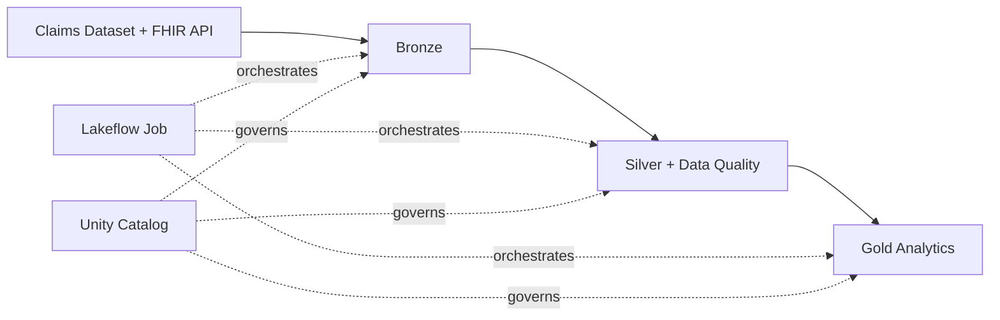
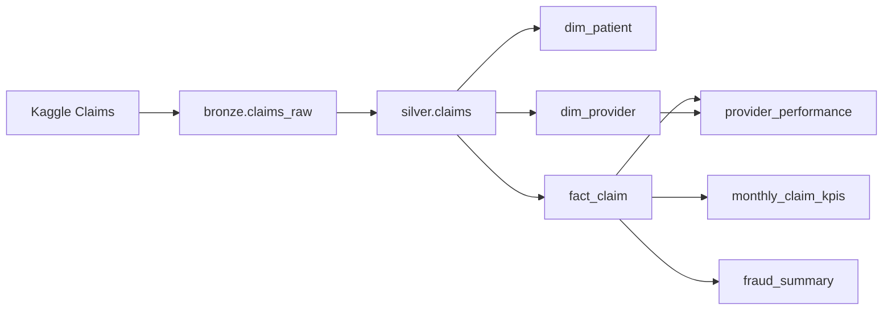
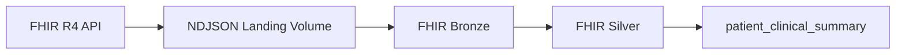
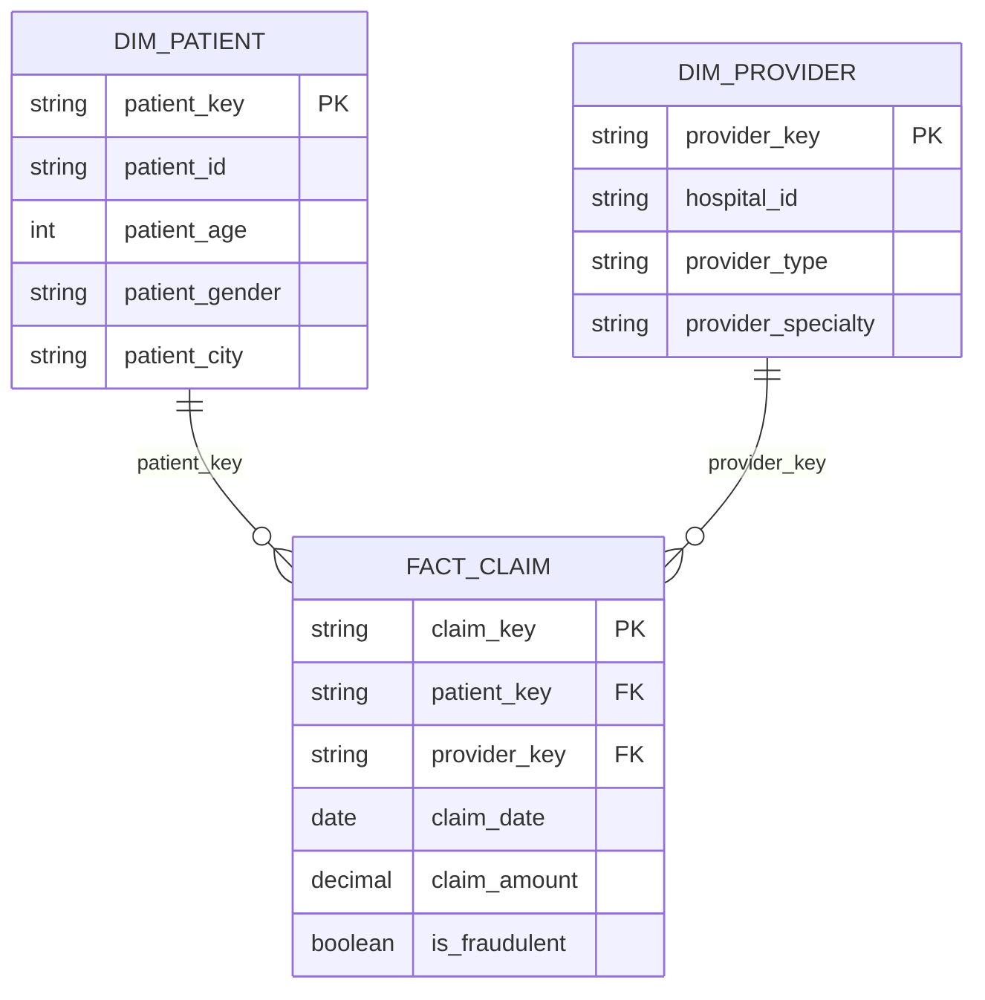
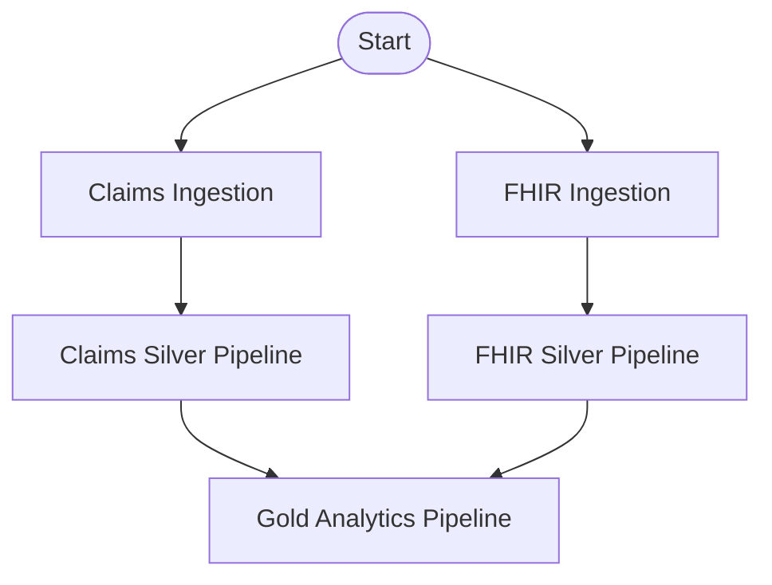

# Khaoula Healthy Insurance — Azure Databricks Lakehouse

An end-to-end healthcare data engineering project built with **Azure Databricks, Delta Lake, Unity Catalog, Lakeflow Declarative Pipelines, Lakeflow Jobs, Auto Loader, PySpark, SQL, and Databricks Asset Bundles**.

I built this project to demonstrate how multiple healthcare data sources can be ingested, governed, transformed, validated, modeled, and orchestrated through a production-style Databricks lakehouse.

The project combines:

- a batch health-insurance Claims dataset
- public SMART Health IT FHIR R4 API data
- Medallion architecture
- governed data-quality rules
- declarative Silver and Gold pipelines
- dimensional and clinical analytical models
- end-to-end workflow orchestration
- Unity Catalog security and governance
- version-controlled Databricks infrastructure

---

## Architecture



The project follows the Medallion architecture:

```text
Sources
   ↓
Bronze
   ↓
Silver
   ↓
Gold
```

**Bronze** preserves raw source data.

**Silver** standardizes, validates, deduplicates, and applies governed data-quality rules.

**Gold** provides dimensional models, KPIs, fraud analytics, Provider analytics, and FHIR clinical summaries.

---

## Data Sources

I use two independent healthcare data sources to demonstrate different ingestion patterns.

### Health Insurance Claims

A structured Kaggle Claims dataset containing:

- **20,100 records**
- **30 source columns**
- Claim and Policy information
- Patient demographics
- Provider information
- healthcare service data
- financial measures
- utilization measures
- historical fraud labels

This source demonstrates **batch ingestion and dimensional analytics**.

### SMART Health IT FHIR R4 API

FHIR resources used:

- `Patient`
- `Condition`
- `Encounter`

The API source demonstrates:

- REST API extraction
- paginated FHIR Bundles
- nested healthcare JSON
- NDJSON landing
- Unity Catalog Volumes
- Auto Loader
- version-aware processing
- resource-reference parsing

The Claims and FHIR Patient identifiers are deliberately **not joined** because no verified crosswalk exists between the two independent source systems.

For more detail, see:

[Data Sources](09-docs/data_sources.md)

---

## Technology Stack

| Area | Technology |
|---|---|
| Cloud | Microsoft Azure |
| Data platform | Azure Databricks |
| Processing | Apache Spark / PySpark |
| Query language | SQL |
| Storage | Delta Lake |
| Governance | Unity Catalog |
| API ingestion | Python + FHIR REST API |
| Incremental file ingestion | Auto Loader |
| Raw API landing | Unity Catalog Volumes |
| Data pipelines | Lakeflow Declarative Pipelines |
| Data quality | Lakeflow Expectations |
| Workflow orchestration | Lakeflow Jobs |
| Compute | Databricks Serverless |
| Deployment | Databricks Asset Bundles |
| Version control | Git / GitHub |

---

# Data Engineering Flow

## Claims Domain



---

## FHIR Domain



FHIR Bronze preserves raw JSON while Silver extracts validated Patient, Condition, and Encounter entities.

Repeated FHIR resource versions are resolved using:

1. `meta.lastUpdated`
2. ingestion timestamp
3. `meta.versionId`

---

# Data Quality

I use a metadata-driven approach instead of hard-coding all quality rules directly inside pipeline functions.

Approved rules are stored centrally in:

```text
health_insurance.governance.quality_rules
```

Each rule contains metadata including:

- dataset
- rule name
- constraint
- severity
- active status
- owner
- version
- source notebook
- timestamps

Silver pipelines dynamically load these rules and apply them through **Lakeflow expectations**.

Three severity levels are used:

| Severity | Behavior |
|---|---|
| `WARN` | Record remains available and the violation is recorded |
| `DROP` | Invalid record is removed |
| `FAIL` | Critical violation stops pipeline processing |

This separates **quality-rule governance** from **pipeline implementation**.

---

# Gold Analytical Model

The Claims Gold layer follows a dimensional design.



### Dimensions

- `dim_patient`
- `dim_provider`

### Fact

- `fact_claim`

### Claims analytics

- `monthly_claim_kpis`
- `fraud_summary`
- `provider_performance`

### FHIR analytics

- `patient_clinical_summary`

The FHIR analytical model remains separate from the Claims star schema because the source Patient identifiers are not proven to represent the same individuals.

For the detailed Gold model, see:

[Gold Analytical Data Model](09-docs/gold_data_model.md)

---

# Lakeflow Pipelines

The project uses three separate declarative pipelines.

### Claims Silver Pipeline

```text
bronze.claims_raw
        ↓
silver.claims
```

### FHIR Silver Pipeline

```text
bronze.fhir_patient_raw
bronze.fhir_condition_raw
bronze.fhir_encounter_raw
        ↓
FHIR Silver datasets
```

### Gold Analytics Pipeline

```text
Claims Silver + FHIR Silver
             ↓
        Gold models
```

Dataset dependencies inside each pipeline are inferred automatically by Lakeflow from the declared reads and transformations.

---

# Workflow Orchestration

Lakeflow Jobs coordinates the separate ingestion notebooks and pipelines.



The Claims and FHIR branches can execute independently.

Gold starts only after both Silver branches complete successfully.

The workflow is intentionally **unscheduled** in the portfolio environment so compute is only used when explicitly triggered.

---

# Databricks Asset Bundles

Databricks resources are maintained as code.

```text
06-pipelines/
├── databricks.yml
└── resources/
    ├── silver_pipelines.pipeline.yml
    ├── gold_pipeline.pipeline.yml
    └── health_insurance_job.job.yml
```

The bundle manages:

- Claims Silver pipeline
- FHIR Silver pipeline
- Gold Analytics pipeline
- end-to-end Lakeflow Job

This makes the Databricks workflow reproducible and keeps infrastructure definitions version-controlled with the transformation code.

---

# Governance and Security

The project uses Unity Catalog for:

- catalog and schema organization
- table and materialized-view governance
- Volumes
- centralized quality-rule metadata
- governed tags
- access control
- PII classification
- column masking

Sensitive clinical fields such as:

- Patient name
- medical record number
- phone number
- birth date
- postal information

can be tagged as PII.

The governance design combines:

```text
RBAC
↓
Controls which datasets users can access

ABAC
↓
Controls how tagged sensitive values are exposed
```

The intended access model separates general analytical users from privileged clinical users.

---

# Performance Strategy

I deliberately avoid applying optimization techniques simply because they are available.

The current datasets are relatively small, so the project does **not** unnecessarily introduce:

- static table partitioning
- manual Z-Ordering
- recurring `OPTIMIZE` jobs

Instead, I evaluate:

- table size
- file count
- Delta history
- predictive optimization
- future liquid clustering
- workload growth
- query patterns

This keeps the portfolio environment cost-conscious while preserving a realistic strategy for future production scale.

---

# Repository Structure

```text
Khaoula-healthy-insurance-project/
│
├── 01-setup/
│   └── Unity Catalog and project setup
│
├── 02-ingestion/
│   ├── Claims ingestion
│   └── FHIR API + Auto Loader ingestion
│
├── 03-silver-transformations/
│   ├── Claims Silver
│   ├── FHIR Patient Silver
│   ├── FHIR Condition Silver
│   └── FHIR Encounter Silver
│
├── 04-data-quality/
│   ├── Claims profiling
│   ├── Patient profiling
│   ├── Condition profiling
│   └── Encounter profiling
│
├── 05-gold-transformations/
│   ├── Dimensions
│   ├── Claim fact
│   ├── Claims analytics
│   └── Clinical analytics
│
├── 06-pipelines/
│   ├── databricks.yml
│   └── resources/
│
├── 07-governance/
│   └── Access control and PII governance
│
├── 08-optimization/
│   └── Performance strategy
│
├── 09-docs/
│   ├── architecture.md
│   ├── data_sources.md
│   ├── gold_data_model.md
│   └── operations.md
│
└── README.md
```

---

# Documentation

Detailed technical documentation is available here:

- [Architecture](09-docs/architecture.md)
- [Data Sources](09-docs/data_sources.md)
- [Gold Analytical Data Model](09-docs/gold_data_model.md)
- [Operations](09-docs/operations.md)

---

# Key Engineering Decisions

### I preserve raw source data

Bronze retains recoverable source representations before business transformations are applied.

### I separate data-quality rules from pipeline code

Quality rules are governed centrally and consumed by the Silver pipelines.

### I do not create unsupported source relationships

FHIR and Claims Patient identifiers remain separate without a verified crosswalk.

### I use deterministic dimensional keys

Patient and Provider keys can be reproduced consistently across pipeline refreshes.

### I separate orchestration from transformation dependencies

Lakeflow Pipelines manage dataset dependencies.

Lakeflow Jobs manage workflow dependencies.

### I keep infrastructure version-controlled

Pipeline and Job definitions are managed through Databricks Asset Bundles.

### I optimize based on evidence

Physical optimization is introduced only when workload scale or query behavior justifies it.

---

# Validation

The Claims Silver declarative pipeline has been validated successfully using the project dataset, processing approximately **20,000 Claims records** with governed Lakeflow expectations.

The remaining workflow resources are designed for triggered execution so full pipeline runs can be controlled explicitly rather than consuming compute continuously.

---

# Skills Demonstrated

This project demonstrates practical experience with:

- Azure Databricks
- Delta Lake
- Unity Catalog
- Medallion architecture
- PySpark transformations
- SQL
- batch ingestion
- REST API ingestion
- Auto Loader
- nested JSON processing
- FHIR healthcare data
- schema standardization
- data-quality profiling
- metadata-driven expectations
- Lakeflow Declarative Pipelines
- materialized views
- dimensional modeling
- fact and dimension design
- deterministic surrogate keys
- Lakeflow Jobs
- dependency orchestration
- Databricks Asset Bundles
- Git-based development
- RBAC
- ABAC
- PII masking
- performance and cost optimization strategy

---

# Project Status

Core engineering implementation is complete.

```text
Data ingestion             ✅
Bronze layer               ✅
Silver transformations     ✅
Data quality               ✅
Silver pipelines           ✅
Gold transformations       ✅
Gold pipeline              ✅
Job orchestration          ✅
Governance                 ✅
Optimization strategy      ✅
Technical documentation    ✅
```

The environment uses manually triggered serverless workloads to keep portfolio testing cost-controlled.

---

## About This Project

I developed this project as a practical end-to-end data engineering portfolio project while strengthening my Azure Databricks and lakehouse engineering skills.

Rather than treating individual Databricks features as isolated exercises, I integrated ingestion, transformation, quality, modeling, orchestration, governance, deployment, and operations into one coherent system.